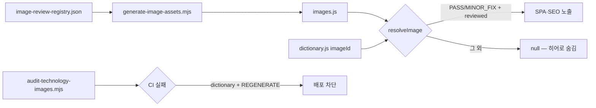
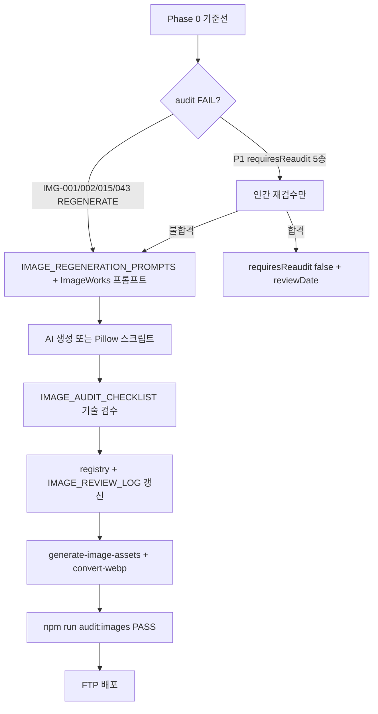

# NMTI 건설계측 기술자료 이미지 — 심층 리서치 구현계획

**작성:** 2026-06-25  
**근거:** 외부 심층 리서치 보고서 · **[25-NMTI-계측-이미지-도면-오류-식별-및-수정계획-보고서.md](./25-NMTI-계측-이미지-도면-오류-식별-및-수정계획-보고서.md)** (2026-06-22 통합)  
**상위 표준:** [TECHNICAL_IMAGE_STANDARD.md](./TECHNICAL_IMAGE_STANDARD.md) · [INSTRUMENTATION_DRAWING_RULES.md](./INSTRUMENTATION_DRAWING_RULES.md)  
**실행 추적:** [IMAGE_REVIEW_LOG.md](./IMAGE_REVIEW_LOG.md) · `scripts/image-review-registry.json` · `scripts/image-review-priority.json`

---

## 1. Executive Summary

외부 리서치의 핵심 결론은 **「틀린 그림을 예쁘게 다듬지 말고, 실제 설치 원리에 맞는 그림만 `reviewed`로 승격한다」**는 것이다. 치명 오류 유형은 다음과 같다.

| 유형 | 예시 |
|------|------|
| 설치 위치 오류 | 어스앵커 하중계를 지중·정착장에 배치 |
| 물리량·방향 혼동 | 지중경사계를 침하계처럼 표현, 토압계 감지면 생략 |
| 계열 혼동 | 건물경사계 ↔ 지중경사계, 지하수위계 ↔ 간극수압계 |
| 장비 개념 오류 | 자동광파기를 CCTV·스캐너처럼 표현(프리즘 누락) |
| 터널 단면 오류 | invert·노반까지 360° 내공변위 계측 (도로·철도 간섭) |

**저장소 현황:** 게이트 문서 5종·`audit-technology-images.mjs`·레지스트리·`resolveImage()` 운영 차단은 **이미 구현됨**. 본 계획은 **잔여 이미지 품질 작업**과 **검수 프로세스 강화**에 초점을 둔다.

**즉시 차단(blocker):** ~~`npm run audit:images` dictionary 참조 4건~~ → **해소** (2026-06-25 Pillow `render-p1-blockers.py`).

---

## 2. 조사 범위·한계

| 항목 | 내용 |
|------|------|
| 판정 기준 | 「계측기 실제 설치 위치·측정 물리량·방향이 일치하는가」 |
| 출처 우선순위 | 제조사 매뉴얼 → FHWA/Caltrans 등 공공 → KCSC/KDS → 학술·보조 |
| 라이브 페이지 | 공개 크롤러로 목록 본문(`불러오는 중…`) 전량 열람 불가 — **로컬 manifest·`images.js`·`dictionary.js`·PNG를 정본**으로 대조 |
| 리서치 vs 저장소 | 리서치 P1 목록과 레지스트리 `auditPriority`는 대체로 일치. **IMG-008**은 리서치 시점 `REGENERATE`였으나 **v4 상부아치 전용** Pillow 렌더 완료·`PASS` |

### 2.1 계측기별 대표 기준 (도면 검수용)

| 계측기/주제 | 대표 기준 | 핵심 확인 |
|-------------|-----------|-----------|
| 흙막이·지반계측 | KCSC KCS 11 10 15 | 설치·측정·자료관리, 계측책임자 문서화 |
| 어스앵커·앵커 두부 | FHWA GEC No.4, GEOKON 4900 | free/bond length, bearing plate, load cell |
| 지중경사계 | GEOKON 6500, SISGEO IPI | 4홈 casing, 안정층 근입, 수평변위 |
| 간극수압계 | GEOKON 4500 | 필터 포화, 심도별 zone isolation |
| 지하수위계 | Solinst 101/Levelogger | well/standpipe 내부 GWL |
| 토압계 | GEOKON 3500 | 감지면·total stress 방향 |
| 하중계 | GEOKON 4900 | annular cell, bearing plate 사이 압축 |
| 균열계 | GEOKON 4415 | crack 양측 anchor, 균열 가로지름 |
| 구조물경사계 | GEOKON 6350 | 구조물 표면 부착 tiltmeter |
| 자동광파기 | Leica GeoMoS/TM60 | 프리즘 타깃 반복 관측 |
| 터널 내공변위 | GEOKON 4425 | 수렴량·상부아치 측점 (노반 미계측) |
| 데이터로거 | Campbell CR1000X (참고) | **도면은 제품 실사가 아닌 범용 산업용 로거** — [§6](#6-데이터로거-정책-레거시-산업용) |

상세 금지·필수 규칙: [INSTRUMENTATION_DRAWING_RULES.md](./INSTRUMENTATION_DRAWING_RULES.md)

---

## 3. 기존 인프라 (재구현 불필요)

리서치 보고서가 제안한 구조는 저장소에 **이미 반영**되어 있다.

```text
docs/
  TECHNICAL_IMAGE_STANDARD.md      ← 운영 게이트
  IMAGE_AUDIT_CHECKLIST.md
  INSTRUMENTATION_DRAWING_RULES.md
  IMAGE_REGENERATION_PROMPTS.md
  IMAGE_REVIEW_LOG.md

scripts/
  image-review-registry.json       ← 단일 메타 정본
  image-review-priority.json         ← P1/P2/P3 목록
  audit-technology-images.mjs      ← npm run audit:images
  generate-image-assets.mjs        ← images.js 생성

js/technology/
  images.js                        ← resolveImage() 운영 차단
  dictionary.js                    ← hero imageId 48종
```

### 3.1 운영 차단 흐름



---

## 4. 리서치 오류표 ↔ 저장소 현황 매트릭스

| IMG | 리서치 판정 | 레지스트리 `reviewGrade` | `requiresReaudit` | dictionary | 권장 조치 |
|-----|-------------|--------------------------|-------------------|------------|-----------|
| **IMG-001** | MAJOR_FIX | **REGENERATE** | 예 | ✅ 참조 | v3 AI 재생성 → 기술 검수 → PASS |
| **IMG-002** | MAJOR_FIX | **REGENERATE** | 예 | ✅ 참조 | v7 프롬프트 AI 재생성 (레이아웃·라벨·센서 구분) |
| **IMG-004** | MAJOR_FIX | PASS | **예** | ✅ | INSTRUMENTATION §3.2 대조 **인간 재검수** — 불합격 시 REGENERATE |
| **IMG-008** | REGENERATE | **PASS** | — | ✅ | v4 상부아치 완료 — [04_터널_내공변위_이미지_가이드.md](../ImageWorks/NMTI_Engineering_Image_Prompt_Package_v1/04_터널_내공변위_이미지_가이드.md) §치명 오류 체크리스트로 최종 확인 |
| **IMG-015** | — | **REGENERATE** | — | ✅ 참조 | 가시설·흙막이 계열 재생성 (IMG-001/002와 동일 §3.1 규칙) |
| **IMG-025** | MAJOR_FIX | PASS | **예** | ✅ | casing·프로브·누적변위 그래프 재검수 |
| **IMG-027** | MAJOR_FIX | PASS | **예** | — | 안정층·수평변위 화살표 재검수 |
| **IMG-030** | MAJOR_FIX | (확인) | P2 | — | 관측공·GWL·보호함 명시 |
| **IMG-031** | REGENERATE | (확인) | P2 | — | open standpipe 폐기, zone isolation |
| **IMG-034** | MAJOR_FIX | PASS | **예** | — | 감지면·토압 방향 재검수 |
| **IMG-035** | MAJOR_FIX | PASS | **예** | — | bearing plate·축방향 압축 재검수 |
| **IMG-037** | MINOR~MAJOR | (확인) | P2 | — | 균열선 중심 레이아웃 |
| **IMG-038** | MAJOR_FIX | (확인) | P2 | — | 구조물 표면 tiltmeter |
| **IMG-042** | MAJOR_FIX | (확인) | P2 | — | TS–프리즘–변위벡터 |
| **IMG-043** | — | **REGENERATE** | — | ✅ 참조 | 자동광파기 개념도 재생성 |
| **IMG-058** | P3 | PASS | — | ✅ | `render:p3` · platform_draw v1 (2026-06-22) |

**P3 시스템 Figure (045·048·056·058):** `npm run render:p3` — registry reviewer `Pillow platform_draw v1`, audit PASS.

**삭제 대상:** 리서치에 언급된 「인접건물 지하 부양」 초안 — 저장소 `rejected/`에 보관·dictionary 미참조 유지.

---

## 5. 단계별 실행 계획

### Phase 0 — 인벤토리 동결·기준선 (1일)

| # | 작업 | 산출물 |
|---|------|--------|
| 0.1 | `npm run audit:images` 실행·결과 고정 | CI 실패 4건 목록 |
| 0.2 | `node scripts/validate-image-master.mjs` | 64/64 PNG·마스터 일치 |
| 0.3 | dictionary 48종 ↔ 레지스트리 `reviewGrade` 교차표 | 본 문서 §4 갱신 |
| 0.4 | `requiresReaudit: true` P1 5종 목록 확정 | IMG-004, 025, 027, 034, 035 |

```bash
npm run audit:images
node scripts/validate-image-master.mjs
node scripts/generate-image-assets.mjs
node scripts/build-content-data.mjs
```

### Phase 1 — P1 즉시 조치 (blocker 해소 우선)

**원칙:** `REGENERATE`·`MAJOR_FIX`는 운영 노출 금지. PASS 전까지 dictionary에서 임시 제거하거나 `imageId`를 PASS 이미지로 대체하지 **않는다** — 재생성 후 승격이 정석.



#### P1 작업 패키지

| 순서 | IMG | 방법 | 스크립트/문서 | 완료 기준 |
|------|-----|------|---------------|-----------|
| 1 | IMG-002 | AI v7 | `prompts/IMG-002_*.md`, `05_흙막이_계측_이미지_가이드.md` | §3.1 치명 0건, audit PASS |
| 2 | IMG-001 | AI v3 | `prompts/IMG-001_*.md` | IMG-002와 동일 단면 규칙 |
| 3 | IMG-015 | AI | 가시설 히어로 | REGENERATE → PASS |
| 4 | IMG-043 | AI | 자동광파기 §3.12 | 프리즘·시준선 필수 |
| 5 | IMG-004 | 재검수 | INSTRUMENTATION §3.2 | 두부 5요소·T/P 분리 확인 |
| 6 | IMG-025, 027 | 재검수 | §3.3 지중경사계 | casing 4홈·안정층 |
| 7 | IMG-034, 035 | 재검수 | §3.5, §3.6 | 감지면·bearing plate |
| 8 | IMG-008 | 확인 | `render-img008-tunnel-convergence.py` | 상부아치·노반 미계측 유지 |

**IMG-002 부분 완료 (2026-06-25):** 레거시 데이터로거 패치(`fix-img002-legacy-logger.py`) — **레이아웃·센서 라벨 문제는 v7 AI 재생성으로 해결** 필요.

### Phase 2 — P2 표현·용어 정밀화

대상: `scripts/image-review-priority.json` P2 — IMG-030, 031, 037, 038, 042, 043(Phase 1 완료 후).

| IMG | 리서치 핵심 | 작업 |
|-----|-------------|------|
| IMG-030 | GWL·standpipe | 관측공 단면도 재작성 |
| IMG-031 | piezometer zone | sand pack + bentonite seal |
| IMG-037 | crackmeter | 균열 가로지름 설치 |
| IMG-038 | tiltmeter | 외벽 브래킷·X/Y |
| IMG-042 | ATS | 기준점–TS–프리즘–Δ좌표 |

각 완료 시: [IMAGE_REGENERATION_PROMPTS.md](./IMAGE_REGENERATION_PROMPTS.md) 섹션 추가 → 검수 → registry.

### Phase 3 — P3 시스템·UI Figure ✅ (2026-06-22)

대상: IMG-058, IMG-045, IMG-048, IMG-056 (원격계측·로거·대시보드).

| ID | 산출 | 비고 |
|----|------|------|
| IMG-045 | `scripts/render-p3-platform.py` · `platform_draw.render_img045` | 레거시 산업용 정면 배선판 |
| IMG-048 | `render_img048` | 센서→로거→LTE→서버→웹·모바일 |
| IMG-056 | `render_img056` | 지도·센서목록·그래프·이벤트로그 와이어프레임 |
| IMG-058 | `render_img058` | 현장·클라우드 레이어 아키텍처 |

```bash
npm run render:p3
python scripts/convert-technology-webp.py --force
node scripts/generate-image-review-log.mjs
node scripts/generate-image-assets.mjs
npm run audit:images   # PASS
```

- 구조적 계측 오류보다 **정보설계·아이콘 일관성**
- 데이터로거는 **§6 레거시 산업용** 스타일 유지 (CR1000X 실사·브랜딩 금지)

### Phase 4 — CI·재발 방지 강화 ✅ (2026-06-22)

| # | 항목 | 상태 | 산출 |
|---|------|------|------|
| 4.1 | `npm run audit:images` 배포 전 필수 | ✅ | package.json |
| 4.2 | `requiresReaudit` → `--strict` 시 error | ✅ | `audit-technology-images.mjs` |
| 4.3 | GitHub Actions audit 연동 | ✅ | `.github/workflows/audit-images.yml` |
| 4.4 | P1/P2/P3 `prohibitedErrors` 검증 | ✅ | strict 시 empty → FAIL |

```bash
npm run audit:images          # 일반 (warning 허용)
npm run audit:images:strict   # 배포·CI — warning·requiresReaudit·prohibitedErrors empty 시 FAIL
npm run ci:images             # strict 별칭
```

전원 Figure(047·065·066·068): `render-power-figures.py` — CR1000X → `draw_legacy_datalogger_front` (v3).

---

## 6. 데이터로거 정책 (레거시 산업용)

리서치의 CR1000X SVG 모식도는 **참고 자료**로만 사용한다. NMTI 운영 정책은 다음과 같다.

| 항목 | 정책 |
|------|------|
| 복합 도면 내 로거 | `scripts/lib/datalogger_draw.py` **레거시 산업용** 인클로저 |
| IMG-045 히어로 | `render-p3-platform` · `draw_legacy_datalogger_front` — CR1000X·브랜드 금지 |
| 제품명 | Campbell Scientific 등 **제3자 브랜드·실사 모델** 복합 도면 삽입 금지 |
| 문서 | `06_데이터로거_CR1000X_이미지_가이드.md` — **레거시 산업용 개정** ✅ (2026-06-22) |

`restore-pre-datalogger-pngs.py` · `fix-img002-legacy-logger.py`로 이미 롤백 완료.

---

## 7. 터널 IMG-008 특별 규칙 (리서치 보정)

리서치는 「ACE-TCS 별도 패널」을 가정했으나 **저장소 정책과 불일치**.

| 금지 | 필수 |
|------|------|
| ACE·제3자 제품명 | 상부 아치 P1~P5 측점 |
| 360° 원형 폐합 | flat **노반 (도로·철도)** |
| invert·노반 Kit·튜브 | 「내공변위 미계측 구간」 라벨 |

렌더: `python scripts/render-img008-tunnel-convergence.py`  
가이드: `ImageWorks/.../04_터널_내공변위_이미지_가이드.md`

---

## 8. 검수·메타데이터 갱신 절차 (반복)

모든 이미지 수정·재생성 후 **동일 순서**를 따른다.

1. PNG → `assets/images/technology/` (`npm run render:p1` 또는 개별 Pillow 스크립트)
2. `python scripts/convert-technology-webp.py --force` (해당 ID)
3. `scripts/image-review-registry.json` — `reviewGrade`, `reviewDate`, `requiresReaudit`
4. `docs/IMAGE_REVIEW_LOG.md` — 앵커 `id="IMG-###"` 항목 갱신
5. `node scripts/generate-image-assets.mjs`
6. `node scripts/build-content-data.mjs`
7. `node scripts/generate-technology-seo-pages.mjs` (히어로 변경 시)
8. `npm run audit:images` **PASS**
9. FTP: PNG·WebP·`images.js`·`content-data.js`·SEO HTML

등급 정의: [IMAGE_AUDIT_CHECKLIST.md](./IMAGE_AUDIT_CHECKLIST.md)

---

## 9. 역할·산출물

| 역할 | 담당 산출 |
|------|-----------|
| 기술 검수자 | IMAGE_AUDIT_CHECKLIST 체크·등급·LOG 기록 |
| 이미지 생성 | ImageWorks 프롬프트·AI 또는 Pillow 스크립트 |
| 개발 | registry·빌드·audit·배포 |
| 문서 | INSTRUMENTATION 규칙·REGENERATION_PROMPTS 동기화 |

### 9.1 문서 동기화 체크리스트

이미지 1건 승격 시 반드시 확인:

- [ ] `image-review-registry.json`
- [ ] `IMAGE_REVIEW_LOG.md`
- [ ] `IMAGE_REGENERATION_PROMPTS.md` (재생성한 경우)
- [ ] ImageWorks `prompts/IMG-###_*.md` 버전号
- [x] `07-미구현-백로그.md` §2.3 상태 — blocker 없음 (2026-06-25)

---

## 10. 일정 제안 (주차)

| 주차 | 목표 | exit criteria |
|------|------|---------------|
| W1 | Phase 0 + IMG-002 v7 | audit FAIL 4 → 3 이하 |
| W2 | IMG-001, 015, 043 | audit FAIL 0 |
| W3 | P1 requiresReaudit 5종 | warnings 0 또는 strict 통과 |
| W4 | P2 6종 착수 | IMG-030, 031 우선 |
| W5+ | P3·CI | audit strict·배포 훅 |

---

## 11. 관련 문서

| 문서 | 용도 |
|------|------|
| [07-미구현-백로그.md](./07-미구현-백로그.md) §2.3 | 실행 백로그 요약 |
| [image-audit.md](./image-audit.md) | 레거시 Phase·hero 44종 이력 |
| [05-기술자료-수정-배포-검증.md](./05-기술자료-수정-배포-검증.md) | FTP·검증 |
| [04-흙막이-계측-구현.md](./04-흙막이-계측-구현.md) | IMG-002 전용 |
| [06-터널-히어로-및-콘텐츠-API.md](./06-터널-히어로-및-콘텐츠-API.md) | IMG-008 API |

---

## 12. 변경 이력

| 일자 | 내용 |
|------|------|
| 2026-06-25 | Phase 2 완료 — `render-p2-sensors` · `render-modes-figures` · audit 75 images PASS |
| 2026-06-25 | 초판 — 외부 심층 리서치 반영, 저장소 현황 매트릭스·Phase 0~4 |
