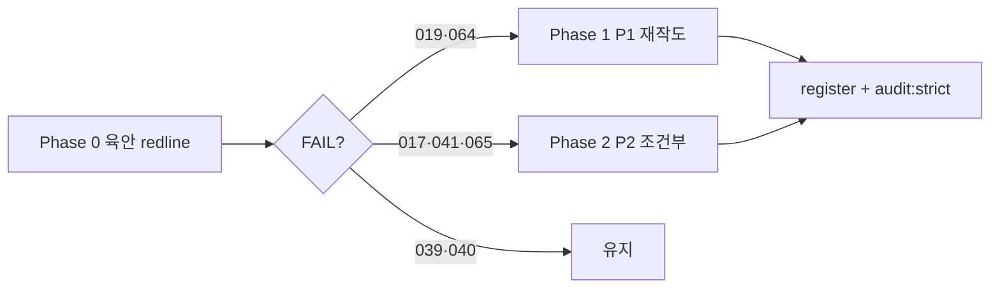

# IMG-017·019·039·040·041·064·065 — 재작도 판정 및 실행 계획

**일자:** 2026-06-30  
**상태:** **Program Exit** — 7종 전부 PASS · 조건부 보류 0 · redline spot-check 완료  
**범위:** 사용자 지정 7종 · `docs/` 정본 · redline · 레지스트리 · **픽셀 직접 수정 아님**  
**상위:** [180 전수 재검수](./180-technology-이미지-전수-재검수-수정계획.md) · [185 S0](./185-IMG-024-011-최우선-재작도-실행계획.md) · [186 S1](./186-IMG-016-004-3-4순위-재작도-실행계획.md) · [181 금지조건](./181-이미지별-계측오류-금지조건-정본.md) · [182 PASS 기준](./182-분야별-계측이미지-PASS-기준.md)

> **큐 순서:** S0 ✅ → S1 ✅ → P1(019·064) ✅ → **P2(017·041·065) ✅** · 유지(039·040)

---

## 0. 판정 원칙

### 0.1 재작도 트리거 (하나라도 해당 시 vN+1 REGENERATE)

| # | 조건 |
|---|------|
| T1 | [180 §1 PASS 5게이트](180-technology-이미지-전수-재검수-수정계획.md) 중 **1개라도 FAIL** |
| T2 | image-knowledge redline **Q1~Q8** 육안 미달 |
| T3 | `prohibitedErrors` 항목이 **픽셀에 재현** |
| T4 | hero 노드 노출 Figure인데 **출판 게이트 V1~V7** 미달 |
| T5 | **내부 검수 문구**(P0·REGENERATE·BRI-01 등)가 Figure에 인쇄 |

### 0.2 유지(재작도 생략) 조건

- 최근 v5/v6 **ai-reviewed** 재생성 완료
- redline 체크리스트 **육안 PASS 서명** 완료
- `npm run audit:images:strict` **0 errors**
- 회귀 검수에서 **T1~T5 전부 해당 없음**

### 0.3 공통 실행 파이프라인 (재작도 시)

```text
1. npm run lock:status
2. prompts/IMG-### + redline + image-knowledge §5·§6 + docs/36 §1.0 + LOGO-01
3. GenerateImage ≥1920×1080 (또는 Pillow FT-C만 해당 시 render 스크립트)
4. source/IMG-###_*_vN.webp → register-external-figure.mjs --method ai-reviewed
5. 레지스트리: hero·prohibitedVerified·notes·productionMethodTarget=ai-reviewed
6. redline 육안 서명 · npm run audit:images:strict · npm run sync:images
```

**금지:** 생성 단계 NMTI 로고·워터마크 — [183 LOGO-01](./183-이미지-생성-워터마크-금지-정본.md)

---

## 1. 종합 판정표

| IMG | 제목 | hero | 현행 | 최종 수정 | **재작도 판정** | 우선순위 | 목표 버전 |
|-----|------|:----:|------|-----------|-----------------|----------|-----------|
| **017** | 평면활동면 계측 해석도 | — | v6 ai-reviewed | 2026-06-30 | **완료** | — | **v6** ✅ |
| **019** | 연약지반 성토부 계측기 설치 배치도 | — | v4 ai-reviewed | 2026-06-30 | **완료** | — | **v4** ✅ |
| **039** | 신축계 설치 개념도 | ✅ | v5 ai-reviewed | 2026-06-30 | **유지** — 육안 FAIL 시만 | P2 | 유지 |
| **040** | 변위계 설치 개념도 | ✅ | v5 ai-reviewed | 2026-06-30 | **재작도 불필요** | — | 유지 |
| **041** | 진동계 설치 개념도 | ✅ | v6 ai-reviewed | 2026-06-30 | **완료** | — | **v6** ✅ |
| **064** | 항만·호안 계측 전체 개념도 | ✅ | v7 ai-reviewed | 2026-06-30 | **완료** | — | **v7** ✅ |
| **065** | 현장 계측 전원 통합 구성도 | — | v3 ai-reviewed | 2026-06-30 | **완료** | — | **v3** ✅ |

**요약:** 7종 **전부 처리 완료** — 재작도 5종(017·019·041·064·065) · 유지 2종(039·040)

---

## 2. 개별 Figure 계획

### IMG-017 — 평면활동면 계측 해석도

| 항목 | 내용 |
|------|------|
| **노드** | `fields/slope` 본문 · 활동면 hero는 **IMG-016** |
| **파일** | `IMG-017_평면활동면-계측-해석도_암반사면평면파괴.webp` |
| **정본** | [prompts/IMG-017](../ImageWorks/NMTI_Engineering_Image_Prompt_Package_v1/prompts/IMG-017_평면활동면_계측_해석도.md) · [redline v2](../ImageWorks/NMTI_Engineering_Image_Prompt_Package_v1/redlines/IMG-017_redline_v2_외부PNG.md) · [13 사면](./image-knowledge/13-사면·비탈면-계측-배치.md) |
| **현행 강점 (v5)** | INTERP-01: 「추정 평면활동면」·안정성 검토식≠계측산정·IPI 3소·G.W.L·U 분리·「변위 최대≠활동면 확정」 |
| **잔여 리스크** | IPI **well cap GL 가시**(BORE-GL-01) 육안 미서명 · 한글 렌더링 오타 · 프로파일↔해석식 **직접 화살표** 재발 |

**판정:** **PASS (v6)** — redline Q1~Q8 spot-check ✅ 2026-06-30 · [193](./193-IMG-017-v6-재생성-기록.md)

**v6 재작도 조건 (하나라도 FAIL):**

- [ ] IPI 천공 개구부·cap이 지표면에서 비가시
- [ ] 무한사면식 → 활동면 **확정 화살표**
- [ ] 간극수압 U = 단순 상향 화살표만
- [ ] 사면 내부 ATS hero

**v6 구성 (재작도 시):** 좌 암반 단면(절리·층리·단층) + IPI 3소 + 우 상「안정성 검토식」/하 변위 프로파일·시간 — **FT-B** · 1920×1080

---

### IMG-019 — 연약지반 성토부 계측기 설치 배치도

| 항목 | 내용 |
|------|------|
| **노드** | `fields/soft-ground` · 분야 대표 Figure · leaf hero는 **IMG-020** 등 |
| **파일** | `IMG-019_연약지반-계측-전체-개념도_성토침하간극수압측방유동.webp` (레거시 slug — rename 금지) |
| **정본** | [109 표준](./109-IMG-019-연약지반-성토부-계측기-설치-배치도-표현-표준.md) · [redline v3](../ImageWorks/NMTI_Engineering_Image_Prompt_Package_v1/redlines/IMG-019_redline_v3_외부PNG.md) · SOFT-LAYOUT-01 · [27 연약지반](./image-knowledge/27-연약지반·압밀-계측.md) |
| **현행** | **v4 ai-reviewed PASS** (2026-06-30) · [189](./189-IMG-019-v4-재생성-기록.md) |
| **잔여 리스크** | slug「전체 개념도」↔ 표제 불일치 — **문서화 완료** ([109 §4](./109-IMG-019-연약지반-성토부-계측기-설치-배치도-표현-표준.md)) · URL 변경 없음 |

**판정:** **✅ 완료 (P1)** — v4 ai-reviewed · redline v3 서명 · docs/109 정본 · CANONICAL_STATUS 반영.

**v4 필수 (PASS 게이트):**

| # | 요소 |
|---|------|
| G1 | 제목 **「연약지반 성토부 계측기 설치 배치도」** · 하단 `[ 계측기 설치 배치도 ]` |
| G2 | **2D 설치 배치 단면** — 흐름도·인포그래픽 주형 **금지** |
| G3 | 지표면 · Sand Mat · 성토 · 연약지층 |
| G4 | 지표침하**판** · 지표침하**핀** (≠ 지표침하계 라벨) |
| G5 | **센서형 다단식 지중경사계** — 안정층 근입 · GL 천공 가시 |
| G6 | 간극수압계 = **filter tip** (≠ 긴 관측공) |
| G7 | 지중침하계 · 지하수위계(수위선) · 토압계(**감지면** 표시) |
| G8 | 성토→압밀→침하 **단계 콜아웃**(그래프 hero 아님) |
| G9 | 로거·서버·모바일 UI **없음** |

**v4 금지:** piezo=standpipe · 침하핀=지표침하계 · IPI 과얕 · 「지중경사계」단독 라벨 · 센서 아이콘 공중 부유

---

### IMG-039 — 신축계 설치 개념도

| 항목 | 내용 |
|------|------|
| **노드** | `sensors/joint-meter` **hero** · `fields/bridge/expansion-joint` |
| **파일** | `IMG-039_신축계-설치-개념도_이음부조인트상대변위.webp` |
| **정본** | [23 신축·변위계](./image-knowledge/23-신축·변위계-구조부재.md) · [52 교량 신축이음](./52-교량-신축이음계-계측-표현-표준.md) |
| **현행 강점 (v5)** | ΔL **1축** · 고정측/이동측 · +/− · ≠LVDT·≠ATS 콜아웃 |

**판정:** **유지 우선** — v5 픽셀·라벨 양호. hero 재노출 비용 대비 리스크 낮음.

**v6 재작도 조건:** 신축이음 **측정축**이 개구 방향과 불일치 · 3축 동시 측정 암시 · 변위계(040)와 동일 범례

---

### IMG-040 — 변위계 설치 개념도

| 항목 | 내용 |
|------|------|
| **노드** | `sensors/displacement-transducer` **hero** |
| **파일** | `IMG-040_변위계-설치-개념도_기준점대상점변위측정.webp` |
| **정본** | LVDT-01 · DISP-ATS-01 · [09 변위·광학](./image-knowledge/09-변위·광학계측-표현-기준.md) |
| **현행 강점 (v5)** | 기준점·이동부 · LVDT+와이어식 · 측정축·stroke·브래킷 유격 · ≠039 · NO ATS |

**판정:** **재작도 불필요** — 7종 중 **유일한「유지 확정」**. redline 서명·회귀 검수만 수행.

---

### IMG-041 — 진동계 설치 개념도

| 항목 | 내용 |
|------|------|
| **노드** | `sensors/vibration-meter` **hero** |
| **파일** | `IMG-041_진동계-설치-개념도_구조물지반3축방향.webp` |
| **정본** | ZIP-AUD-06 · [24 진동·소음](./image-knowledge/24-진동·소음-계측-표현.md) · ≠097 |
| **현행 강점 (v5)** | 구조물 고정형·지반 매설형 · 3축 · 가속도 vs PPV **별도 축** |
| **잔여 리스크** | 지중 매설 **GL 개구·케이싱** 표현 · 지중형이 IPI 관과 혼동 가능 · 출판 V게이트 미서명 |

**판정:** **PASS (v6)** — redline Q1~Q7 spot-check ✅ 2026-06-30 · [194](./194-IMG-041-v6-재생성-기록.md)

---

### IMG-064 — 항만·호안 계측 전체 개념도

| 항목 | 내용 |
|------|------|
| **노드** | `fields/harbor` **hero** · quay-wall·surrounding-ground 보조 |
| **파일** | `IMG-064_항만-호안-계측-전체-개념도_케이슨옹벽주변지반.webp` |
| **정본** | HAR-Q01~03 · [19 항만](./image-knowledge/19-항만·호안-계측-배치.md) · IMG-084(구조물 변위) **역할 분리** |
| **현행 (v7)** | 육측\|케이슨\|해측 · 조위·G.W.L · ai-reviewed 2026-06-30 |
| **잔여 리스크** | 구조 변위 상세는 **084**와 역할 분리 유지 |

**판정:** **PASS (v7)** — redline v2 spot-check ✅ 2026-06-30 · [190](./190-IMG-064-v7-재생성-기록.md)

**v7 필수 (재작도 시):**

| # | 요소 |
|---|------|
| H1 | `[ 육측 | 케이슨/안벽 | 해측 ]` 3분할 명시 |
| H2 | 조위선·조위계 · G.W.L · 간극수압 **분리** |
| H3 | 반력계 = **하부 바닥 모서리**(KDS §4.1.8.4) — 벽체 중앙 금지 |
| H4 | IPI·지하수위 **GL 천공 가시** (BORE-GL-01) |
| H5 | 변위·경사 = **구조물 표면 부착** (084 상세는 callout만) |
| H6 | 로거 = **방수 함체** 또는 **064에서 생략**(개요 Figure) |
| H7 | 「동일 단면」 주석 · ATS hero 금지 |

---

### IMG-065 — 현장 계측 전원 통합 구성도

| 항목 | 내용 |
|------|------|
| **노드** | `instruments/power/overview` 등 전원 하위 |
| **파일** | `IMG-065_현장-계측-전원-통합-구성도_태양광풍력AC배터리.webp` |
| **정본** | [08 데이터로거·시스템](./image-knowledge/08-데이터로거-계측시스템-구성.md) · FT-C |
| **현행** | v2 `render-power-figures.py` · 2026-06-26 · interim PASS |
| **잔여 리스크** | FT-C **출판 게이트** 구버전 · 태양광·풍력·AC·배터리·LVD **블록 가독성** · P0-3 함체 표현 |

**판정:** **조건부 (P2)** — hero 아님 · 노출 낮음. **FT-C V1~V7** 육안 후 FAIL 시 v3.

**v3 재작도 시:** 주·백업·보조 전원 · DC 분배 · LVD · 함체 실루엣(빈 박스 금지) — **블록도만** · 센서 단면 혼입 금지

---

## 3. 실행 순서 (재작도가 필요한 경우)



| Phase | IMG | 작업 | 산출 |
|-------|-----|------|------|
| **0** | 전 7종 | redline Q 체크 · 5게이트 · 내부 문구 스캔 | 판정표 갱신 |
| **1** | **019** | v4 ai-reviewed · SOFT-LAYOUT-01 · docs/109 복구 | WebP + registry |
| **1** | **064** | v7 ai-reviewed · H1~H7 · 로거/과밀 정리 | WebP + registry |
| **2** | 017·041 | redline FAIL 항목만 v6 | 조건부 WebP |
| **2** | 065 | FT-C V게이트 FAIL 시 v3 | 조건부 WebP |
| **—** | 039·040 | **재작도 생략** | redline 서명만 |

**예상 공수 (재작도 시):** P1 2종 × 1일 · P2 조건부 0~3종 × 0.5일 · 육안 검수 0.5일

---

## 4. 검수·Exit

```bash
npm run lock:status
npm run audit:images:strict          # 0 errors
npm run audit:figure-production      # policy·targetMethod 정합
# redline 서명: ImageWorks/.../redlines/IMG-###_redline_*.md
```

| Exit 조건 | 기준 |
|-----------|------|
| **019 v4 PASS** | redline v3 전항 PASS · prohibitedErrors 0건 재현 |
| **064 v7 PASS** | H1~H7 + redline v2 Q1~Q8 |
| **조건부 4종** | FAIL 없으면 현행 v 유지 · `requiresReaudit: false` |
| **040** | 추가 작업 없음 |

---

## 5. 레지스트리 정리 (병행)

| IMG | 조치 |
|-----|------|
| 017·039·040·041 | `productionMethodTarget` → `ai-reviewed` (policy JSON 동기화) |
| 019 | ✅ `renderScript` 제거 · caption 정합 · [109 §4](./109-IMG-019-연약지반-성토부-계측기-설치-배치도-표현-표준.md) slug 문서화 |
| 064 | v7 후 `prohibitedVerifiedNote` 갱신 |
| 065 | v3 후 `visualReview.notes` · FT-C gates 재서명 |

---

## 6. 결론 (의사결정 요약)

| 질문 | 답 |
|------|-----|
| **7종 전부 다시 그려야 하나?** | **아니오 — 완료.** 재작도 5종(017·019·041·064·065) PASS · 유지 2종(039·040). |
| **전체 112 WebP 중 최우선?** | S0·S1·P1·P2 **완료** — 회귀만 [213](./213-이미지-제작-실행계획.md) FIG-PROD-01 |
| **가장 먼저 할 일?** | **없음** — WATCH 14종 분기 spot-check · CANONICAL_STATUS 유지 |
| **문서 선행?** | **IMG-019** — ✅ docs/109 정본 · §4 slug · CANONICAL_STATUS |

**정본 갱신:** 본 문서 · [185](./185-IMG-024-011-최우선-재작도-실행계획.md) · 개별 PASS 후 `IMAGE_REVIEW_LOG.md` · `docs/180` §4 레지스트리 원칙 준수
