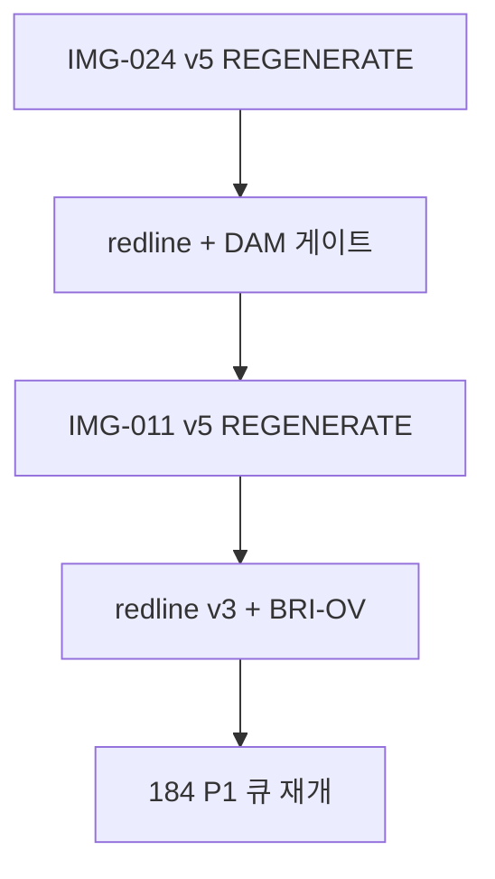

# IMG-024·IMG-011 — 최우선 재작도 실행 계획 (S0)

**일자:** 2026-06-30  
**판정:** Git·문서·레지스트리 기준 **심각도 최상위 2종**  
**상위:** [180 전수 재검수](./180-technology-이미지-전수-재검수-수정계획.md) · [184 7종 판정](./184-IMG-017-019-039-040-041-064-065-재작도-판정-및-실행계획.md)

> **한 줄:** **IMG-024 = 안전판정 오류(시한폭탄급)** · **IMG-011 = 교량 대표 분야 개념 오류** — 레지스트리 PASS와 무관하게 **전면 REGENERATE 우선**.

---

## 0. S0 우선순위 (전체 112 WebP 중)

| 순위 | IMG | 제목 | 심각도 | 핵심 리스크 |
|:----:|-----|------|--------|-------------|
| **1** | **IMG-024** | 댐 안전관리 계측 체계도 | **최상 (S0-A)** | 침하·수두·간극수압·누수 해석이 **안전판정을 반대로** 읽게 할 수 있음 |
| **2** | **IMG-011** | 교량 계측 전체 개념도 | **상 (S0-B)** | hero 대표 Figure에서 **부재·계측기·물리량 대응** 오류 시 교량 분야 전체 신뢰도 붕괴 |

**운영 원칙:** S0 완료 전 [184](./184-IMG-017-019-039-040-041-064-065-재작도-판정-및-실행계획.md) P1·P2 큐는 **보류** 권장.

> **✅ S0 완료 (2026-06-30):** IMG-024 v5 · IMG-011 v5 ai-reviewed PASS · `requiresReaudit: false` · `audit:images:strict` 0 errors

**다음:** [184 P1](./184-IMG-017-019-039-040-041-064-065-재작도-판정-및-실행계획.md) — IMG-019 · IMG-064 (S1 ✅)

---

## 1. IMG-024 — 댐 안전관리 계측 체계도

### 1.1 판정

| 항목 | 값 |
|------|-----|
| **노드** | `fields/dam` **hero** |
| **파일** | `IMG-024_댐-안전관리-계측-체계도_필댐6항목데이터흐름.webp` |
| **현행** | v4 ai-reviewed (2026-06-29) · registry `PASS` |
| **목표** | **v5 REGENERATE** — 픽셀 회귀 검수 **FAIL** 시 즉시 |
| **정본** | [32 오류분석](./32-IMG-024-댐-계측-개념도-오류분석-및-재작업-계획.md) · [39 전면수정](./39-IMG-024-댐-안전관리-계측-체계도-전면-수정-계획.md) · [152 침윤선](./152-IMG-024-댐-피에조-침윤선-정합성-수정계획.md) · [181 §IMG-024](./181-이미지별-계측오류-금지조건-정본.md#img-024) |

### 1.2 왜 최상위인가

댐 Figure는 홍보용이 아니라 **침하·침윤선·간극수압·누수·경보단계**를 한 화면에 보여주는 **안전관리 그림**이다. 그래프 방향·수두 개념이 틀리면 사용자는 「위험이 줄어든다」 또는 「계측기 설치가 맞다」고 **오해**할 수 있다.

[32 §2.1](./32-IMG-024-댐-계측-개념도-오류분석-및-재작업-계획.md) — **DAM-01 시한폭탄급:** 침하 그래프에서 `-20mm = 경보`, `-60mm = 관리기준` **역전** → 침하가 클수록 안전하게 보임.

### 1.3 현행 오류 (재발 방지 — `prohibitedErrors` 유지)

| 코드 | 항목 | 문제 |
|------|------|------|
| **DAM-01** | 침하 그래프 | 침하 심각 구간이 관리기준/안전처럼 보임 · Y축 부호와 색역 **역전** |
| **DAM-02** | 침윤선 | 피에조 수두·filter tip과 **불일치** |
| **DAM-03** | 간극수압계 | 개방 우물/standpipe처럼 표현 |
| **DAM-LEAK** | 누수 | 제체 내부 센서처럼 오해 · 하류 배수·집수·유량계로 표현해야 함 |
| DAM-04~07 | 형상·흐름 | 중력식 혼재 · 7단계 흐름 누락 · 항목별 관리 로직 불일치 |

### 1.4 v5 수정 방향 (전면 재작성)

```text
IMG-024 v5 — 필댐/석괴댐 안전관리 계측 체계도

1. 침하 그래프 (DAM-01):
   - 0에 가까움 = 정상/관리 (Green)
   - 하향 침하량 증가(더 음수) = 주의 → 경보/위험 (Orange → Red)
   - Y축 밴드 위치를 스케일에 정합 — 역전 금지

2. 간극수압계 (DAM-03):
   - open standpipe 금지
   - filter tip + grout/seal + cable 분리 표현
   - tip ≠ 침윤선 고도

3. 침윤선 (DAM-02):
   - piezometric head 별도 수두점
   - 저수위·toe drain·배수조건과 정합하는 해석 곡선
   - filter tip과 동일시 금지

4. 누수 (DAM-LEAK):
   - 제체 내부 점 센서 금지
   - 하류 배수층·집수부·V-notch/유량계·측수로 유량

5. 레이아웃 (39 정본):
   - 6항목 패널 · 7단계 데이터 흐름 · Governing Message
   - 내부 검수 문구·로고·워터마크 금지 (LOGO-01)
```

### 1.5 v5 PASS 게이트

- [ ] 침하: **아래로 갈수록(절대값 증가)** 위험 단계 강화
- [ ] piezo: **filter tip** 위치 가시 · standpipe 아님
- [ ] 침윤선: tip 수두선과 **분리** · 해석선 각주
- [ ] 누수: **하류 유량** 맥락 · 제체 매몰 센서 없음
- [ ] 6항목 + 7단계 흐름 · 필댐 단면 일관
- [ ] `prohibitedErrors` DAM-01~07 **0건 재현**
- [ ] redline 육안 서명 · `audit:images:strict` 0 errors

### 1.6 실행

```bash
npm run lock:status
# prompts/IMG-024 + docs/32·39·152·36 §4.9① + LOGO-01
# GenerateImage ≥1920×1080 (FT-A — 부분 수정 금지)
node scripts/register-external-figure.mjs --id IMG-024 --input ... --method ai-reviewed --reviewer agent --visual-grade PASS
npm run audit:images:strict
```

**목표 버전:** v5 · **완료 후** `requiresReaudit: false` · `prohibitedVerifiedDate` 갱신

---

## 2. IMG-011 — 교량 계측 전체 개념도

### 2.1 판정

| 항목 | 값 |
|------|-----|
| **노드** | `fields/bridge` **hero** |
| **파일** | `IMG-011_교량-계측-전체-개념도_상부구조교각교대기초.webp` |
| **현행** | v4 ai-reviewed (2026-06-29) · registry `PASS` |
| **목표** | **v5 REGENERATE** (최소 MAJOR_FIX 불가 시) |
| **정본** | [116 v3 표준](./116-IMG-011-교량-계측-전체-개념도-v3-표현-표준.md) · [28 §1 감사](./28-NMTI-건설계측-기술자료-이미지-공학-감사-보고서.md) · [181 §IMG-011](./181-이미지별-계측오류-금지조건-정본.md#img-011) |

### 2.2 왜 2순위인가

`IMG-011`은 교량 분야 **대표 개념도**이다. [28](./28-NMTI-건설계측-기술자료-이미지-공학-감사-보고서.md) 반복 오류 패턴 — **「교량 부재·계측기 불일치」** — 의 대표 사례. zip 판정 P0 · 이후 v4 PASS이나 **회귀 방지·픽셀 미확정** 상태.

교량 규칙: **교면·거더·교각·교대·받침·신축이음·기초**가 중심 — **흙막이·버팀보·굴착 공동·배면 매립** 템플릿 재사용 **금지** (BRI-01).

### 2.3 구조 계층 (먼저 그릴 것)

```text
상부구조 = 교면, 슬래브, 거더, 주경간
받침 = 상부구조와 교각/교대 사이
하부구조 = 교각, 교대, 주탑
기초 = 교각·교대 하부
```

### 2.4 10종 계측기 ↔ 부재 대응 (v5 필수)

| # | 계측기 | 위치/물리량 |
|---|--------|-------------|
| ① | 변형률계 | 거더·PSC 표면 strain |
| ② | 온도계 | 교면·부재 온도 |
| ③ | 가속도계 | 교면·거더 동적 응답 |
| ④ | 처짐계 | **주경간 중앙** 수직 δ |
| ⑤ | 신축이음계 | 이음부 개폐량 ↔ |
| ⑥ | 케이블장력계 | 사장 케이블 축방향 **T** |
| ⑦ | 풍향풍속계 | **주탑 상부** |
| ⑧ | 무응력계 | 크리프·온도 보정 |
| ⑨ | 구조물경사계 | 교각·주탑 표면 **θ** |
| ⑩ | 기초침하·광파 | **⑩-A** 기초 침하 측점 · **⑩-B** 프리즘·시준선 (단일 아이콘 금지) |

### 2.5 v5 수정 방향

```text
IMG-011 v5 — 사장교형 교량 전체 개념도

1. 교량 구조 계층을 먼저 정확히 그린다 (§2.3).
2. 10종 계측기를 실제 부재에 부착 — 라벨만 붙은 점 금지.
3. 내부 검수 문구 제거: PASS, REGENERATE, P0, BRI-01 등.
4. 흙막이·굴착·배면지반 템플릿 재사용 금지.
5. 우측 25% = 대외 요약만 (116 §5).
6. LOGO-01 — 생성 시 워터마크·로고 금지.
```

### 2.6 v5 PASS 게이트

- [ ] **사장교 단일** — 일반 거더교 혼재 없음
- [ ] ④ 처짐 = 주경간 중앙 δ (침하계·기초 아님)
- [ ] ⑥ 케이블 T = 케이블 **축선 동축**
- [ ] ⑨ 경사계 = 교각 **표면 부착** (지중경사계 아님)
- [ ] ⑩-A/B 분리 — 삼각형 하나 혼동 없음
- [ ] BRI-01 금지 요소 0건
- [ ] redline v3 육안 서명

### 2.7 실행

```bash
npm run lock:status
# prompts/IMG-011 + docs/116 + redline v3 + 36 §1.0 + LOGO-01
# GenerateImage ≥1920×1080 (FT-C 개념도 — ai-reviewed)
node scripts/register-external-figure.mjs --id IMG-011 --input ... --method ai-reviewed --reviewer agent --visual-grade PASS
npm run audit:images:strict
```

**목표 버전:** v5

---

## 3. 통합 실행 순서



| Phase | 작업 | 산출 | 예상 |
|-------|------|------|------|
| **S0-A** | IMG-024 v5 전면 재작성 | WebP · registry · prompt v5 | 1일 |
| **S0-B** | IMG-011 v5 전면 재작성 | WebP · registry · prompt v5 | 1일 |
| **검수** | 육안 redline · 5게이트 · prohibitedErrors | `requiresReaudit: false` | 0.5일 |

---

## 4. 레지스트리 정책 (2026-06-30)

| 필드 | IMG-024 | IMG-011 |
|------|---------|---------|
| `reviewGrade` | PASS 유지 (교체 전 노출) | 동일 |
| `requiresReaudit` | **true** | **true** |
| `auditPriority` | **P0** | **P0** |
| `notes` | S0-A v5 REGENERATE 대기 | S0-B v5 REGENERATE 대기 |
| `prohibitedErrors` | **삭제 금지** | **삭제 금지** |

> v5 PASS·육안 검수 완료 후 `requiresReaudit: false` · `prohibitedVerified*` 갱신.

---

## 5. AGENTS·184 연계

- **AGENTS.md** — IMG-024·011 항목을 **S0 REGENERATE 대기**로 갱신
- **[184](./184-IMG-017-019-039-040-041-064-065-재작도-판정-및-실행계획.md)** — 실행 순서 상단에 S0 선행 명시
- **[180 §2.1](./180-technology-이미지-전수-재검수-수정계획.md)** — S0 최우선 2종 표 추가

---

## 6. Exit

```bash
npm run audit:images:strict
npm run validate:heroes
npm run verify:local
```

| Exit | 조건 |
|------|------|
| **S0 완료** | IMG-024 v5 + IMG-011 v5 redline PASS · DAM-01~03·BRI-OV 0건 재현 |
| **회귀 방지** | 32·116·181 prohibitedErrors 레지스트리 동기화 |
