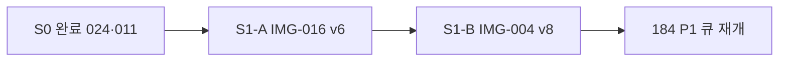

# IMG-016·IMG-004 — 3·4순위 재작도 실행 계획 (S1)

**일자:** 2026-06-30  
**판정:** S0(IMG-024·011) **완료 후** Git·문서 기준 **3·4순위**  
**상위:** [180 전수 재검수](./180-technology-이미지-전수-재검수-수정계획.md) · [185 S0](./185-IMG-024-011-최우선-재작도-실행계획.md) · [184 7종](./184-IMG-017-019-039-040-041-064-065-재작도-판정-및-실행계획.md)

> **한 줄:** **IMG-016 = 해석 오류(활동면 확정 인상)** · **IMG-004 = 설치·하중전달 오류** — 레지스트리 PASS와 무관하게 **픽셀 회귀 검수·vN+1 REGENERATE**.

---

## 0. S1 우선순위 (S0 완료 후)

| 순위 | IMG | 제목 | 심각도 | 핵심 리스크 |
|:----:|-----|------|--------|-------------|
| **3** | **IMG-016** | 원호활동면 계측 해석도 | **P0 회귀 위험 (S1-A)** | IPI 프로파일·최대변위 심도로 **활동면 확정** 인상 |
| **4** | **IMG-004** | 어스앵커 하중계 설치 개념도 | **P0 REGENERATE (S1-B)** | LC 위치·T/P·사선축 오류 시 **계측 원리 자체 붕괴** |

**운영:** `requiresReaudit: true` · redline 육안 **FAIL 1건 = vN+1 전면 재작성** · 부분 수정 금지(특히 IMG-004).

---

## 1. IMG-016 — 원호활동면 계측 해석도 (S1-A)

### 1.1 판정

| 항목 | 값 |
|------|-----|
| **노드** | `fields/slope/slip-surface` |
| **파일** | `IMG-016_원호활동면-계측-해석도_원호파괴지중경사계프로파일.webp` |
| **현행** | v5 ai-reviewed (2026-06-29) · registry `PASS` |
| **목표** | **v6 REGENERATE** — INTERP-01 회귀 시 즉시 |
| **정본** | [prompts/IMG-016](../ImageWorks/NMTI_Engineering_Image_Prompt_Package_v1/prompts/IMG-016_원호활동면_계측_해석도.md) · [181 §IMG-016](./181-이미지별-계측오류-금지조건-정본.md#img-016) · [13 사면](./image-knowledge/13-사면·비탈면-계측-배치.md) |

### 1.2 왜 3순위인가

사면 **붕괴 가능 활동면 해석** Figure. 추정선을 확정선처럼 그리면 「계측값만으로 활동면 확인」 오해.

**치명 금지 (INTERP-01):**

```text
최대 변위 심도 = 원호활동면 위치          ← 금지
IPI 프로파일 = 활동면 확정                ← 금지
원호활동면 = 실측 확정선                  ← 금지
```

### 1.3 필수·금지 라벨

| 구분 | 라벨 |
|------|------|
| **필수** | `추정 원호활동면` · `전단변형 집중 구간` · `활동면 추정 구간` · `안정해석 검토` · `단일 IPI만으로 활동면 확정 금지` |
| **금지** | `최대변위=활동면` · `IPI 단독 확정` · `확정 원호활동면` |

### 1.4 v6 수정 방향

```text
1. 제목·라벨 → 「추정 원호활동면」 통일
2. IPI 누적변위 곡선 = 「측정 프로파일」만
3. 최대변위 심도 = 「전단변형 집중 구간」(≠ 활동면 위치)
4. 활동면 = 점선·음영 「추정 구간」
5. 안정해석 원호 = 「검토 모식도」 분리 (우측 패널)
6. 지질·G.W.L·간극수압·균열·침하·현장관찰 병행 callout
```

### 1.5 v6 PASS 게이트

- [ ] 좌: 토사 사면 + **센서형 다단식 지중경사계** (케이싱·다점·안정층·GL 천공 가시)
- [ ] 중: 변위–깊이 프로파일 — **실선=측정** · **점선=추정 구간**
- [ ] 우: 원호파괴 **「안정해석 검토」** — 계측 확정 아님
- [ ] 하: 병행 검토 callout 5종 이상
- [ ] `prohibitedErrors` 3건 **0건 재현**
- [ ] redline v2 육안 서명

### 1.6 실행

```bash
npm run lock:status
# prompts/IMG-016 + INTERP-01 + docs/36 §1.0 + LOGO-01
# GenerateImage ≥1920×1080 (FT-B)
node scripts/register-external-figure.mjs --id IMG-016 --input ... --method ai-reviewed --reviewer agent --visual-grade PASS
npm run audit:images:strict
```

**목표 버전:** v6

---

## 2. IMG-004 — 어스앵커 하중계 설치 개념도 (S1-B)

### 2.1 판정

| 항목 | 값 |
|------|-----|
| **노드** | `fields/retaining-excavation/anchor` **hero** |
| **파일** | `IMG-004_어스앵커-하중계-설치-개념도_앵커두부정착구.webp` |
| **현행** | v7 ai-reviewed (2026-06-29) · registry `PASS` |
| **목표** | **v8 REGENERATE** — **부분 수정 금지** |
| **정본** | [54 표현 표준](./54-IMG-004-어스앵커-하중계-설치-표현-표준.md) · [83 ANC-CLOCK](./83-어스앵커-하중계-ANC-CLOCK-정본.md) · [181 §IMG-004](./181-이미지별-계측오류-금지조건-정본.md#img-004) |

### 2.2 왜 4순위인가

어스앵커 하중계는 **「어디에 설치되는가」**가 핵심. LC를 지중·정착장·자유장에 두거나 수평 버팀보형으로 그리면 **계측기 종류·하중 전달 원리 자체가 틀림**.

외부 감사·[54](./54-IMG-004-어스앵커-하중계-설치-표현-표준.md): **REGENERATE · P0** — 부분 수정 아닌 **전면 재생성** 타당.

### 2.3 치명 오류 대조

| 오류 | 올바른 방향 |
|------|-------------|
| LC가 지중·정착장·자유장 중간 | LC = **굴착측 두부**, 반력판 외측 |
| 반력판→LC→헤드→웨지→tendon 순서 불명 | 조립 순서 **도면상 가시** |
| T와 P 단일 화살표 | **T**=강연선 인장 · **P**=LC 압축 반력 **분리** · **동축 사선** |
| 자유장·정착장 미구분 | free/bond + 그라우트 표시 |
| 하중계 수평(3~9시) | **ANC-CLOCK 1~7시** 사선 · 앵커 축 동축 |

### 2.4 v8 수정 방향

```text
1. 굴착측 외부 노출 앵커 두부 중심
2. 강연선·관통점·반력판·하중계·헤드 = 같은 사선축 (1~7시, NOT 수평)
3. 조립: 반력판 → 하중계 → 가압판/헤드 → 웨지 → tendon
4. T / P 분리 화살표
5. 배면: 자유장·정착장·그라우트 명확 분리
6. 3분할: [배면 지반] | [벽체] | [굴착측] — 띠장·LC 굴착측만
```

### 2.5 v8 PASS 게이트

- [ ] LC **굴착측 두부** · 반력판–LC–헤드 사이
- [ ] **ANC-CLOCK** 사선 동축 · 수평 버팀보형 **0건**
- [ ] T·P **분리** · 동축 또는 연장선 일치
- [ ] 정착장·자유장·그라우트 구분
- [ ] SOE 3분할 · 로거/서버 hero 없음
- [ ] `prohibitedErrors` 전항 **0건 재현**
- [ ] redline · [54 §검수] 육안 서명

### 2.6 실행

```bash
npm run lock:status
# prompts/IMG-004 + docs/54 §1 강제지시문 + docs/83 ANC-CLOCK + LOGO-01
# GenerateImage ≥1920×1080 (FT-A — 부분 수정 금지)
node scripts/register-external-figure.mjs --id IMG-004 --input ... --method ai-reviewed --reviewer agent --visual-grade PASS
npm run audit:images:strict
```

**목표 버전:** v8

---

## 3. 통합 실행 순서



| Phase | IMG | 예상 |
|-------|-----|------|
| **S1-A** | IMG-016 v6 | 0.5~1일 |
| **S1-B** | IMG-004 v8 | 0.5~1일 |
| **검수** | redline · 5게이트 | 0.5일 |

---

## 4. 레지스트리 정책

| 필드 | IMG-016 | IMG-004 |
|------|---------|---------|
| `requiresReaudit` | **false** (v6 완료) | **false** (v8 완료) |
| `auditPriority` | **P0** | **P0** |
| `reviewGrade` | PASS 유지(교체 전) | 동일 |
| `prohibitedErrors` | **삭제 금지** | **삭제 금지** |

v6/v8 PASS·육안 완료 후 `requiresReaudit: false` · `productionMethodTarget: ai-reviewed` 동기화.

---

## 5. 전체 순위 요약 (1~4)

| 순위 | IMG | 유형 | 상태 (2026-06-30) |
|:----:|-----|------|-------------------|
| 1 | IMG-024 | 안전판정 | ✅ v5 완료 |
| 2 | IMG-011 | 대표 분야 | ✅ v5 완료 |
| 3 | IMG-016 | 해석 오류 | ✅ v6 완료 (2026-06-30) |
| 4 | IMG-004 | 설치·하중 | ✅ v8 완료 (2026-06-30) |

**다음:** [184](./184-IMG-017-019-039-040-041-064-065-재작도-판정-및-실행계획.md) P1(019·064)
