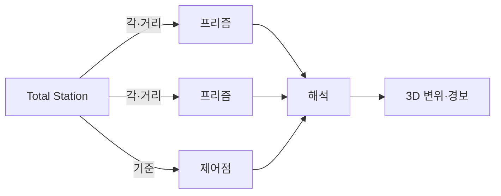
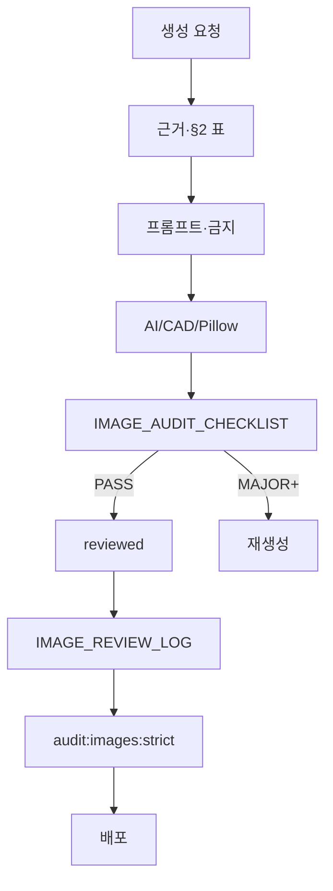

# NMTI 홈페이지 기술자료 — 계측 이미지·도면 오류 식별 및 수정계획 보고서

> **계측 도면 검수 공통 (2026-06-26):** [51-계측-도면-검수-공통-원칙](./51-계측-도면-검수-공통-원칙.md) — FIG-01 · 가시설 배치 · IPI-EMBED · INST · REJECT

**작성:** 2026-06-22 (외부 심층 감사 반영)  
**공학 감사 정본:** [28-NMTI-건설계측-기술자료-이미지-공학-감사-보고서.md](./28-NMTI-건설계측-기술자료-이미지-공학-감사-보고서.md) — **그림·글 작성 시 §1 참고 순서**  
**용도:** 모든 Figure(IMG-###) 재생성·검수·프롬프트 작성의 **상위 근거 문서**  
**상위 표준:** [TECHNICAL_IMAGE_STANDARD.md](./TECHNICAL_IMAGE_STANDARD.md) · [24-토목-계측-개념도-및-구성도-작성-가이드라인.md](./24-토목-계측-개념도-및-구성도-작성-가이드라인.md)  
**실행:** [IMAGE_REGENERATION_PROMPTS.md](./IMAGE_REGENERATION_PROMPTS.md) · [IMAGE_REVIEW_LOG.md](./IMAGE_REVIEW_LOG.md) · `scripts/image-review-registry.json`

---

## 0. Executive summary

NMTI 기술자료는 「계측 분야·계측기별 개요·목적·원리·설치·데이터 해석·관리기준」을 정리하는 **공개 기술 라이브러리**이다. 이미지는 홍보 삽화가 아니라 **설치 위치·하중 전달·변위 방향·지층·구조물 관계**를 공학적으로 전달하는 기술 도면이어야 한다.

### 조사 한계

| 항목 | 내용 |
|------|------|
| 공개 웹 | SPA 목록이 클라이언트 렌더링 — 크롤러만으로 전 항목·원본 PNG 완전 수집 **불가** |
| 본 보고서 정본 | **로컬** `assets/images/technology/` · `images.js` · `dictionary.js` · 사용자 제공 캡처 |
| 판정 구분 | **확정 오류**(캡처·육안) vs **고위험 재검수**(원본 미확보·PASS 등급이나 외부 감사 이슈 잔존) |

### 확정·고위험 요약 (외부 감사 + 저장소 대조)

| 이미지 | 외부 감사 | 저장소 현황 (2026-06-22) | **통합 조치** |
|--------|-----------|---------------------------|---------------|
| **IMG-004** | **REGENERATE** | PASS (일괄 마이그레이션) | **P0 — 전면 재생성** [26](./26-IMG-004-어스앵커-하중계-오류분석-및-재작업-계획.md) |
| **IMG-005** | **MAJOR_FIX** | PASS v2 (단면 C1~C5) | **P1 — v3** ATS·tilt·그래프 [15 §10](./15-IMG-005-주변건물-균열경사-오류분석-및-재작업-계획.md) |
| **IMG-002** | **MAJOR_FIX** | PASS v3b (doc19 P1~P5) | **P1 — v4** 용어·수위/수압·토압면·앵커 inset [19 §10](./19-IMG-002-흙막이-계측-대표-단면도-오류분석-및-재작업-계획.md) |
| IMG-008 | 고위험 | **PASS v7** → **ZIP-AUD-01 REGENERATE** | [77 Phase Z-1a](./77-외부-ZIP-전수검수-신규-심각오류-10종-및-수정계획.md) · 연속 센서 튜브 |
| IMG-027 | 고위험 | **PASS v2** (doc17) | ✅ 완료 |
| IMG-096 | — | **PASS v1** (doc18) | ✅ 완료 |
| **ZIP 10종** | **REGENERATE 5 · MAJOR 5** | PASS 유지 **금지** | [77](./77-외부-ZIP-전수검수-신규-심각오류-10종-및-수정계획.md) · [IMAGE_REGENERATION_PROMPTS §ZIP](./IMAGE_REGENERATION_PROMPTS.md) |
| IMG-025 | 고위험 | PASS (마이그레이션) | **P2 육안 재검수** |
| IMG-034 | 매우 높음 | PASS (마이그레이션) | **P2 육안 재검수** |
| IMG-035 | 매우 높음 | PASS (마이그레이션) | **P2 육안 재검수** |

**원칙:** `reviewGrade`가 PASS여도 외부 감사 **확정 오류**와 충돌하면 `requiresReaudit: true` + 본 보고서 Phase에 따라 **등급 하향·재생성**한다. [08-심층리서치](./08-기술자료-이미지-심층리서치-구현계획.md) · `npm run audit:images:strict` 운영 차단과 병행.

---

## 1. 근거 체계

### 1.1 판단 우선순위

1. 제조사 설치도·매뉴얼 (GEOKON, Sisgeo, Solinst, Leica 등)
2. 국내 기준·지침 (KCS 11 10 15, KOSHA 굴착공사 계측관리 기술지침)
3. FHWA GEC 등 공공 기술자료
4. 학술·기술보고서 (보조)

### 1.2 검수 핵심 질문 (생성 전·후)

- 이 센서는 **어디에** 설치되는가?
- **무엇을** 측정하는가? (물리량 정의)
- 힘·변위 **방향**이 그림과 일치하는가?
- **반력·기준점·감지면**이 닫혀 있는가?
- 비슷한 계측기와 **혼동**되지 않는가?

→ [TECHNICAL_IMAGE_STANDARD.md §2](./TECHNICAL_IMAGE_STANDARD.md) · [24-가이드라인 §4](./24-토목-계측-개념도-및-구성도-작성-가이드라인.md)

---

## 2. 계측기별 실제 설치 원리 — 도면 필수 기준표

> **운영 반영:** [INSTRUMENTATION_DRAWING_RULES.md](./INSTRUMENTATION_DRAWING_RULES.md) §3.x와 동일. 신규 Figure·재생성 프롬프트는 **본 표 전항**을 `[조건/제약사항]`에 포함한다.

| 계측기 | 실제 설치·원리 | 도면 필수 요소 | 금지 표현 |
|--------|----------------|---------------|-----------|
| **어스앵커 하중계** | annular/center-hole LC는 **앵커 두부** bearing plate 사이; tendon **인장 T** → LC **압축 P** | 띠장, 반력판, LC, 헤드, 웨지, 강연선, 자유장, 정착장, 그라우트, T·P 분리 | 지중·정착장 내부, bearing plate 생략, T/P 단일 화살표 |
| **버팀보 하중계** | strut **축방향 압축**; 띠장–버팀보 접합 **끝단** | 버팀보, 띠장, LC, 축압축 화살표 | 보 **정중앙**, 옆면 장식 |
| **지중경사계** | casing + **다점 센서**; Base = 영향 심도/활동면 **하부 안정층**(설계·계획서); **수평변위** | 연속 casing, 내부 노드, 그라우트, Base, 활동면, **→** 외향 | 침하계형, 단일 프로브, Base 얕음/미도달, **←** 역방향, **임의 m 일반화** |
| **지하수위계** | **개방 관측공**·자유 수면 | 관측공, Cap, 스크린/필터, G.W.L, probe | 벽체 부착, 간극수압과 동형 |
| **간극수압계** | **밀폐** 천공 특정 심도; filter·seal·grout | body, filter zone, seal, grout, 심도 | 개방 관측공, 수위만 |
| **토압계** | **감지면** + total pressure **방향** | plate, 접촉면, **배면→벽체** 토압 화살표 | 원형 아이콘, 방향 없음 |
| **웨일·변형률계** | 강재 **표면** 부착; gauge axis | member, axis, (쌍배치) | 장식 1점 |
| **균열계** | 균열 **가로지름**; 양측 anchor | anchor, crack, opening | 균열 평행 |
| **구조물경사계** | 표면 **tilt plate**; **기울기 θ** | plate, peg, X/Y tilt | 「변위 센서」 단독, 지중경사계 혼동 |
| **자동광파기** | **Total Station** + **복수 프리즘** + **기준점** + 시준선 | TS 본체, prism, CP, LoS, ΔX·ΔY | 프리즘만, CCTV, 기준점 없음 |
| **터널 내공변위** | **상부 아치** kit; 노반 **미계측** | P1~P5, 개방 체인, Envelope **외측** | 360° 폐합, invert Kit, ACE 브랜드 |

상세: INSTRUMENTATION §3.2~§3.11 · [24 §2](./24-토목-계측-개념도-및-구성도-작성-가이드라인.md)

---

## 3. 확정 오류 식별 (외부 감사 + 캡처)

### 3.1 IMG-002 흙막이 계측 대표 단면도 — **MAJOR_FIX (v4)**

**저장소:** PASS v3b — 배면·앵커 방향·G.W.L 시나리오 등 doc19 P1~P5 **반영됨**.  
**외부 감사 잔여:**

| # | 오류 | 조치 (v4) |
|---|------|-----------|
| E1 | 범례 **「경사계」** 혼용 — 건물=**구조물경사계**, 천공=**지중경사계** | 라벨 분리 · §3.3 vs §3.8 |
| E2 | ⑤ 지하수위 vs ⑥ 간극수압 **시각 동형** | 관측공+수면 vs 밀폐+filter+seal **이형** |
| E3 | ⑦ 토압계 **감지면·토압 방향** 불명 | 배면→벽체 화살표 + plate |
| E4 | ⑪ 앵커하중계 **두부 inset** 부족 | 우측/하단 **확대도** (IMG-004 연계) |

→ [19-IMG-002 §10](./19-IMG-002-흙막이-계측-대표-단면도-오류분석-및-재작업-계획.md) · 프롬프트 v8

### 3.2 IMG-004 어스앵커 하중계 — **REGENERATE**

**저장소:** PASS (일괄 마이그레이션) — **외부 감사와 불일치 → 최우선 REGENERATE.**

| # | 오류 |
|---|------|
| R1 | LC가 **지중·자유장/정착장 중간**처럼 보임 |
| R2 | `반력판 → LC → 헤드 → 웨지 → tendon` 순서 불명 |
| R3 | **T(인장)** vs **P(압축)** 미분리 |
| R4 | 자유장·정착장 구분 없음 |

→ [26-IMG-004](./26-IMG-004-어스앵커-하중계-오류분석-및-재작업-계획.md) · INSTRUMENTATION §3.2

### 3.3 IMG-005 주변건물 균열·경사 — **MAJOR_FIX (v3)**

**저장소:** PASS v2 — **단면 물리 C1~C5 해소**.  
**외부 감사 잔여 (계측 체계):**

| # | 오류 | 조치 (v3) |
|---|------|-----------|
| B1 | **Total Station 본체·기준점·시준선** 없음 — 프리즘만 | ATS **네트워크도** 분리 |
| B2 | 경사계를 **변위 센서**처럼 표현 | **기울기 θ** 주, 변위는 보조 |
| B3 | 균열 추세 **0.3/0.6/0.9 mm** 고정값 오해 | 「예시·현장별 관리기준」 주석 |
| B4 | **단일 프리즘**으로 전체 거동 대표 | 복수 prism + LoS |
| B5 | 굴착–건물 **계측 시나리오** 단절 | 흙막이·L·영향권·측점 목적 연결 |

→ [15-IMG-005 §10](./15-IMG-005-주변건물-균열경사-오류분석-및-재작업-계획.md)

---

## 4. 하중·계측 체계 스케치 (재생성 필수 참조)

### 4.1 어스앵커 두부 하중 경로


### 4.2 자동광파기(AMTS) 계측



---

## 5. 수정계획 (Phase)

> **Living Plan (실행 정본):** [29-NMTI-기술자료-이미지-공학-감사-수정계획.md](./29-NMTI-기술자료-이미지-공학-감사-수정계획.md) — Phase 0~7 · 현황 매트릭스 · BRI-01 잔여 · Exit  
> 아래는 **2026-06-22 초안** (Phase 1~5 요약). 상세·갱신은 **doc 29** 우선.

### Phase 0 — 문서·운영 ✅

| # | 산출 |
|---|------|
| 0.1 | 본 문서 (doc 25) |
| 0.2 | [26-IMG-004](./26-IMG-004-어스앵커-하중계-오류분석-및-재작업-계획.md) |
| 0.3 | doc 19·15 **§10** 외부 감사 잔여 |
| 0.4 | [IMAGE_REGENERATION_PROMPTS.md](./IMAGE_REGENERATION_PROMPTS.md) §외부감사 |
| 0.5 | registry — **004 REGENERATE** · 002·005 Phase 추적(체크리스트 §5) |

### Phase 1 — P0 IMG-004 REGENERATE (1~2일)

| # | 작업 |
|---|------|
| 1.1 | 3분할 구도: 전체 단면 + **두부 확대** + 하중 원리도 |
| 1.2 | AI+검수 또는 CAD → PNG |
| 1.3 | registry **PASS** · §3.2 prohibitedVerified |
| 1.4 | IMG-002 inset과 **조립 순서 일치** 검수 |

**Exit:** doc 26 체크리스트 · `audit:images:strict`

### Phase 2 — P1 IMG-005 v3 (1~2일)

| # | 작업 |
|---|------|
| 2.1 | 주도면: 굴착·흙막이·건물·**복수 prism·TS·CP·LoS** |
| 2.2 | 경사계 패널: **θ / X·Y tilt** |
| 2.3 | 그래프 「예시 관리기준」 |
| 2.4 | doc 15 §10 exit · registry |

### Phase 3 — P1 IMG-002 v4 (2~3일)

| # | 작업 |
|---|------|
| 3.1 | E1~E4 반영 — v3b **유지 항목**(배면·앵커←·G.W.L) **회귀 금지** |
| 3.2 | 앵커 inset = Phase 1 PNG **동일 조립** |
| 3.3 | doc 19 §10 · 프롬프트 v8 |

### Phase 4 — P2 육안 재검수 (025·034·035)

| ID | 확인 포인트 | 불합격 시 |
|----|-------------|-----------|
| 025 | 4홈 casing, probe chain, stable layer, 수평변위 그래프 | MAJOR_FIX 또는 REGENERATE |
| 034 | 감지면, 배면 토압 방향, ≠ 관측공 | REGENERATE |
| 035 | strut vs anchor **역할 분리**, 축압축 | REGENERATE |

### Phase 5 — 완료·동기화

```bash
python scripts/convert-technology-webp.py --force
node scripts/generate-image-assets.mjs
node scripts/build-content-data.mjs
node scripts/generate-technology-seo-pages.mjs
npm run audit:images:strict
npm run validate:heroes
```

---

## 6. 검수 등급·운영 (저장소 적용 상태)

| 등급 | 운영 |
|------|------|
| PASS / MINOR_FIX | `resolveImage()` 허용 |
| MAJOR_FIX / REGENERATE / DELETE | **노출 차단** |

**이미 구현:** `TECHNICAL_IMAGE_STANDARD` · `audit-technology-images.mjs --strict` · `IMAGE_REVIEW_LOG` 앵커 · [16 SVG 금지](./16-기술자료-이미지-에이전트-SVG-생성-금지.md)

**워크플로:**



---

## 7. 연계 문서

| 문서 | 역할 |
|------|------|
| [08-심층리서치-구현계획](./08-기술자료-이미지-심층리서치-구현계획.md) | Phase·P1/P2/P3 실행 이력 |
| [24-가이드라인](./24-토목-계측-개념도-및-구성도-작성-가이드라인.md) | 보고서·지침서 삽입용 |
| [19-IMG-002](./19-IMG-002-흙막이-계측-대표-단면도-오류분석-및-재작업-계획.md) | IMG-002 |
| [26-IMG-004](./26-IMG-004-어스앵커-하중계-오류분석-및-재작업-계획.md) | IMG-004 |
| [15-IMG-005](./15-IMG-005-주변건물-균열경사-오류분석-및-재작업-계획.md) | IMG-005 |
| [20-IMG-008](./20-IMG-008-터널-내공변위-오류분석-및-재작업-계획.md) | IMG-008 — **ZIP-AUD-01 재개** [77](./77-외부-ZIP-전수검수-신규-심각오류-10종-및-수정계획.md) |
| [77-ZIP-10](./77-외부-ZIP-전수검수-신규-심각오류-10종-및-수정계획.md) | **외부 ZIP 207종 — 신규 심각 10종** |
| [17-IMG-027](./17-IMG-027-지중경사계-설치단면도-오류분석-및-재작업-계획.md) | IMG-027 ✅ |

---

## 8. 변경 이력

| 일자 | 내용 |
|------|------|
| 2026-06-22 | 신규 — 외부 심층 감사 보고서 저장소 반영 · Phase 0~5 · §2 기준표 |
| 2026-06-26 | **외부 ZIP 207종** — 신규 심각 10종 · [77](./77-외부-ZIP-전수검수-신규-심각오류-10종-및-수정계획.md) · IMG-008 등 PASS **철회·재검수** |
