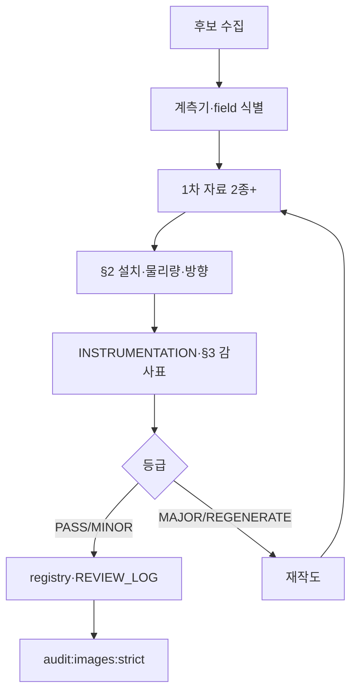

# NMTI 건설계측 기술자료 — 이미지 공학 감사 보고서

**작성:** 2026-06-22 (외부 공학 감사 + 저장소 대조)  
**목적:** Figure(IMG-###)·기술자료 **글·도면 작성·수정 시 반드시 참고** — 홍보 일러스트가 아닌 **설치 원리·물리량·힘 전달**을 정확히 전달  
**실행·Phase:** [25-수정계획-보고서](./25-NMTI-계측-이미지-도면-오류-식별-및-수정계획-보고서.md) · **운영 차단:** `npm run audit:images:strict`

---

## 0. 요약

NMTI 기술자료는 「계측 분야·계측기별 개요·목적·원리·설치·데이터 해석·관리기준」을 정리한다고 명시하므로, 삽입 Figure는 **설치 원리와 물리량을 정확히 설명하는 기술 도면**이어야 한다.

### 반복 오류 패턴 (12종 · 2026-06-29 갱신)

> **정본:** [130 §2](./130-기술자료-이미지-전수감사-디자인원칙-수정계획.md) · [132](./132-계측이미지-분야별-금지표현-정본.md)

| # | 패턴 | 대표 |
|---|------|------|
| 1 | **분야–도면 불일치** | `#fields/bridge`에 굴착·흙막이 |
| 2 | **어스앵커 LC 위치·방향** | 지중·수평 LC · ANC-CLOCK 위반 |
| 3 | **버팀보 LC ↔ 앵커 LC** | IMG-035 · STR-01 |
| 4 | **지중경사계 ↔ 구조물경사계** | CLS-01 |
| 5 | **간극수압 ↔ 지하수위** | EXC-03 · P0-8 |
| 6 | **침하 그래프 역전** | DAM-01 · IMG-024 |
| 7 | **원호활동면 확정** | INTERP-01 · IMG-016 |
| 8 | **교량 부재·계측기 불일치** | BRI-OV · IMG-011 |
| 9 | **GNSS ↔ 와이어 처짐 혼합** | SPAN-MID-01 · IMG-103 |
| 10 | **터널 내공변위 과잉** | IMG-008 · 하부 도로 무시 |
| 11 | **범례-본도 불일치** | LEGEND-01 |
| 12 | **내부 코드·AI 로고** | EXT-01 · LOGO-01 |

### P0 재작성 8종 (zip 112 WebP · 2026-06-29)

> **정본:** [180](./180-technology-이미지-전수-재검수-수정계획.md) · [181](./181-이미지별-계측오류-금지조건-정본.md) · 레지스트리 PASS = 재생성 완료 · **회귀 방지**는 `prohibitedErrors` 유지

| IMG | WebP 파일명 | zip 판정 | 레지스트리 |
|-----|-------------|----------|------------|
| IMG-002 | `IMG-002_흙막이-계측-설치-대표-단면도.webp` | P0 | PASS (v6) |
| IMG-004 | `IMG-004_어스앵커-하중계-설치-개념도_앵커두부정착구.webp` | P0 | PASS (v7) |
| IMG-006 | `IMG-006_굴착-단계별-계측-흐름도_1단계최종굴착계측.webp` | P0 | PASS (v4) |
| IMG-011 | `IMG-011_교량-계측-전체-개념도_상부구조교각교대기초.webp` | P0 | PASS (v4) |
| IMG-016 | `IMG-016_원호활동면-계측-해석도_원호파괴지중경사계프로파일.webp` | P0 | PASS (v5) |
| IMG-024 | `IMG-024_댐-안전관리-계측-체계도_필댐6항목데이터흐름.webp` | P0 | PASS (v4) |
| IMG-035 | `IMG-035_하중계-설치-개념도_버팀보앵커하중전달.webp` | P0 | PASS (v3) |
| IMG-096 | `IMG-096_주변지반-계측-설치-대표-단면도_굴착영향권복합.webp` | P0 | PASS (v5) |

**P1:** 30건 · **P2 PASS 후보:** 74건 — [180 §2](./180-technology-이미지-전수-재검수-수정계획.md)

### P0 재작성 9종 (풀네임 · 레거시 표 — 130)

| IMG | WebP 파일명 | 문서 판정 |
|-----|-------------|-----------|
| IMG-024 | `IMG-024_댐-안전관리-계측-체계도_필댐6항목데이터흐름.webp` | PASS (v4) |
| IMG-002 | `IMG-002_흙막이-계측-설치-대표-단면도.webp` | PASS (v6) |
| IMG-004 | `IMG-004_어스앵커-하중계-설치-개념도_앵커두부정착구.webp` | PASS (v7) |
| IMG-006 | `IMG-006_굴착-단계별-계측-흐름도_1단계최종굴착계측.webp` | PASS (v4) |
| IMG-011 | `IMG-011_교량-계측-전체-개념도_상부구조교각교대기초.webp` | PASS (v4) |
| IMG-016 | `IMG-016_원호활동면-계측-해석도_원호파괴지중경사계프로파일.webp` | PASS (v5) |
| IMG-035 | `IMG-035_하중계-설치-개념도_버팀보앵커하중전달.webp` | PASS (v3) |
| IMG-096 | `IMG-096_주변지반-계측-설치-대표-단면도_굴착영향권복합.webp` | PASS (v5) |
| IMG-098 | `IMG-098_항만-호안-조위지하수-계측-개념도_외해사석매립지하수위.webp` | PASS (v3) |

### 반복 오류 패턴 (5종 · 레거시 요약)

### 조사 한계 (SPA)

공개 URL 크롤러는 SPA 셸만 수집할 수 있어 **라이브 전 항목 자동 전수감사는 불가**. 본 보고서의 **확정 오류**는 사용자 캡처·저장소 `assets/images/technology/`·`dictionary.js`·`image-review-registry.json` 대조 기준이다. **2차 전수감사는 저장소 + `npm run verify:local` 필수.**

### KCS 취지

KCS 10 50 10(건설 계측공사)은 계측항목·설치 위치·수량·빈도·기간을 **측정 목적에 부합**하도록 정할 것을 요구한다. 설치 위치·물리량이 틀린 Figure는 「예시」가 아니라 **기준 취지와 충돌하는 잘못된 설명자료**이다.

> **범위 제외 (사용자 지시):** CR1000X·데이터로거 **외형** 전용 Figure — [06 데이터로거 가이드](../ImageWorks/NMTI_Engineering_Image_Prompt_Package_v1/06_데이터로거_CR1000X_이미지_가이드.md)

---

## 1. 그림·글 작성 시 참고 순서 (필독)

에이전트·디자이너·콘텐츠 작성자는 **작업 시작 전** 아래 순서를 따른다.

| 순서 | 문서 | 용도 |
|------|------|------|
| 1 | [TERMINOLOGY.md](./TERMINOLOGY.md) · `book/KDS-KCS_용어기준.md` | 용어·라벨 |
| 1a | [`book/kds-kcs-citation-registry.json`](../book/kds-kcs-citation-registry.json) · [TECHNICAL §0a](./TECHNICAL_IMAGE_STANDARD.md) | **KDS/KCS 근거 조항** · IMG·nodeId 출처 |
| 2 | **본 문서 §2·§3** | 계측기별 설치 기준·확정 오류·감사 ID |
| 2b | **[51](./51-계측-도면-검수-공통-원칙.md)** | **DP-01~80** · [59](./59-계측-운영-모드-구조-환경-AI-표현-표준.md) · [60](./60-계측-절차-구조-항만-건축-표현-표준.md) · [61](./61-계측-Figure-단순화-분리-표준.md) · [62](./62-계측-도면-구성-라벨-범례-검수-표준.md) · [65](./65-계측-Figure-유형-분리-레이아웃-표준.md) · **R-01~R-83** |
| 3 | [27-지표면-건물-안착-원칙.md](./27-지표면-건물-안착-원칙.md) | 굴착 단면 **C0** (1층·출입구 = 지표면) |
| 4 | [TECHNICAL_IMAGE_STANDARD.md](./TECHNICAL_IMAGE_STANDARD.md) | 강제 표준·배포 차단 |
| 5 | [INSTRUMENTATION_DRAWING_RULES.md](./INSTRUMENTATION_DRAWING_RULES.md) | IMG별 치명·필수·금지 |
| 6 | [24-통합 가이드](./24-토목-계측-개념도-및-구성도-작성-가이드라인.md) | 보고서·지침서 삽입용 |
| 7 | [14-AI 가이드 §2](./14-흙막이-굴착-계측-개념도-AI-생성-가이드라인.md) | 흙막이·가시설 프롬프트 붙여넣기 |
| 7a | [36-AI 엔지니어링 프롬프트 가이드](./36-AI-이미지-생성-엔지니어링-프롬프트-가이드.md) | **★ Global Negative · nodeId별 EN · Cursor 템플릿** |
| 7b | [37-반영 실행 계획](./37-AI-프롬프트-가이드-반영-실행-계획.md) | **Phase 0~5 · 픽셀감사 · 재제작 일정** |
| 8 | [IMAGE_AUDIT_CHECKLIST.md](./IMAGE_AUDIT_CHECKLIST.md) | 검수 등급·체크리스트 |
| 9 | `ImageWorks/.../prompts/IMG-###_*.md` | 해당 Figure 프롬프트 |
| 10 | [IMAGE_REVIEW_LOG.md](./IMAGE_REVIEW_LOG.md) | 승인 기록 |
| 11 | [30-외부검증대조](./30-NMTI-건설계측-기술자료-외부공학검증-대조-및-수정계획.md) | 외부 감사 ↔ Phase 5~8 · AUTO·CLS |

**콘텐츠(글) 수정 후:** `node scripts/validate-terminology.mjs` → `node scripts/build-content-data.mjs`  
**Figure 수정 후:** PNG/WebP → `npm run build:images` → `npm run audit:images:strict`

### 생성 전 4항목 (미작성 시 작업 금지)

```text
1. 설치 위치 (어디에 부착·매설되는가)
2. 측정 물리량 (무엇을 읽는가)
3. 측정·힘 전달 방향 (화살표·감지면·기준점)
4. 금지 표현 (본 문서 §2·INSTRUMENTATION 해당 §)
5. Figure 목적 단일성 (P0-4) · 가시설 3분할 (P0-5) · 띠장/버팀보/앵커 배치 (P0-6) — [51 §0](./51-계측-도면-검수-공통-원칙.md)
```

---

## 2. 계측기별 올바른 설치 기준·금지 표현

> **운영 반영:** [INSTRUMENTATION_DRAWING_RULES.md](./INSTRUMENTATION_DRAWING_RULES.md) §3.x · [25 §2](./25-NMTI-계측-이미지-도면-오류-식별-및-수정계획-보고서.md)

| 계측기 | 올바른 설치 위치/지점 | 측정 물리량 | Figure 필수 요소 | 금지 표현 |
|--------|----------------------|-------------|------------------|-----------|
| **센서형 다단식 지중경사계** | 보어홀 **4홈 casing**, **영향 심도/활동면 하부 안정층**까지 근입(설계·계획서) | 심도별 **수평변위** | casing·다점 센서·Base·활동면·**→** 외향 | 건물 벽면 경사계, 침하계형 막대, 「지중경사계」단독, **임의 m 일반화** |
| **구조물경사계** | 표면 **베이스플레이트/브래킷** | **기울기 θ** (X/Y) | plate·peg·θ | 「변위 센서」 단독, 지중경사계 혼동 |
| **간극수압계** | 특정 심도 **폐쇄형** 센서·필터 | **간극수압** | body·filter·seal/grout·심도 | 관측정형 개방관 |
| **지하수위계(관측정)** | 슬롯·필터 **개방/반개방** 관 | **지하수위(G.W.L)** | 수위선·Cap·관측공 | 간극수압계 동형·벽체 부착 |
| **토압계** | 구조물–지반 **접면** | **토압**(감지면 방향) | plate·**배면→구조물** 화살표 | 아이콘만·방향 없음 |
| **어스앵커 하중계** | **반력판–헤드 사이** 두부 | **압축 반력 P** (T와 분리) | 띠장→반력판→LC→헤드→강연선→정착 | 지중·정착장·그라우트 내부 |
| **버팀보 하중계** | **띠장–보 끝단** 접합 | **축압축력** | 축방향 화살표·지압판 | 보 **정중앙**·옆면 장식 |
| **균열계** | 균열 **양측 anchor** | 개구·상대변위 | crack·anchor 2·gauge 축 **교차** | 균열과 **평행**·떨어진 위치 |
| **변형률계** | 강재 **표면** arc/spot | **strain** | gauge axis·부착면 | 표면에서 떠 있음 |
| **자동광파기** | **부동점** TS + 시준선 | **3D 변위** | TS·CP·LoS·**복수** prism | **프리즘만**·옥상 TS 본체 |

**근거 패킷 (1차 자료):** Geokon·Sisgeo·RST·Trimble 설치 매뉴얼 · KCS 11 10 15 · FHWA GEC · Tieback 검사 지침 — 상세는 각 IMG 계획 문서.

---

## 3. 확정 오류 감사표 (감사 ID)

| ID | NMTI 요소 | 문제 | 심각도 | 저장소 매핑·조치 |
|----|-----------|------|--------|------------------|
| **BRI-01** | `#fields/bridge` 대표 Figure | 굴착·흙막이·주변건물 맥락 | **REGENERATE** | 교량 hero **전수 점검** · [§3.23 INSTRUMENTATION](./INSTRUMENTATION_DRAWING_RULES.md) |
| **BRI-02** | Bridge strain/tilt/prism 일러스트 | 타 분야 generic 재사용 | **MAJOR** | `fields/bridge/*` imageId 전수 · 부재 실착 여부 |
| **BLD-01** | IMG-005 균열계 | 균열선 **미교차** | **REGENERATE** | [15-IMG-005 §10](./15-IMG-005-주변건물-균열경사-오류분석-및-재작업-계획.md) · v3 |
| **BLD-02** | IMG-005 구조물경사계 | 「기울기/변위」 혼용 | **MAJOR** | **θ** 주 · 변위=ATS/프리즘 분리 |
| **BLD-03** | IMG-005 자동광파기 | 프리즘만·TS·CP·LoS 없음 | **MAJOR** | ATS **네트워크도** · [25 §4.2](./25-NMTI-계측-이미지-도면-오류-식별-및-수정계획-보고서.md) |
| **BLD-04** | IMG-005 맥락 | 버팀보 단면이 주력 배경 | **MAJOR** | 건물·L·측점 **주체** · 단면 최소화 |
| **EXC-01** | IMG-002·004 앵커 하중계 | 지반·정착부 오해 | **REGENERATE** | [26-IMG-004](./26-IMG-004-어스앵커-하중계-오류분석-및-재작업-계획.md) · §3.2 |
| **EXC-02** | IMG-002 경사계 라벨 | 지중 vs 구조물 혼동 | **MAJOR** | **센서형 다단식 지중경사계** vs **구조물경사계** |
| **EXC-03** | IMG-002 수위·수압 | ②③ 동형 관 | **MAJOR** | 개방 관측공 vs 밀폐 filter **이형** |
| **EXC-04** | IMG-002 토압계 | 감지면·방향 없음 | **MAJOR** | [19-IMG-002 §10](./19-IMG-002-흙막이-계측-대표-단면도-오류분석-및-재작업-계획.md) |
| **EXC-05** | IMG-002·001 단면 | 건물·1층·지층 (C0) | **REGENERATE** | [27-지표면-원칙](./27-지표면-건물-안착-원칙.md) · v5 |
| **AUTO-01** | 025·030·031 hero/principle | manual-only·logger chain 누락 | **MAJOR** | [30 §2.3](./30-NMTI-건설계측-기술자료-외부공학검증-대조-및-수정계획.md) · §3.24 |
| **CLS-01** | 전 Figure | 센서 **클래스** 혼동 (경사·수위·균열·ATS) | **MAJOR** | [28 §2](./28-NMTI-건설계측-기술자료-이미지-공학-감사-보고서.md) 표 · EXC·BLD |
| **STR-01** | IMG-035 | strut LC vs anchor LC | **MAJOR** | §3.7 · Phase 5 |
| **DAM-01** | IMG-024 침하 그래프 | 관리기준·경보 **Y축 역전** (-20=경보, -60=관리) | **REGENERATE** | [32-IMG-024](./32-IMG-024-댐-계측-개념도-오류분석-및-재작업-계획.md) · §3.25 |
| **DAM-02** | IMG-024 침윤선 | Phreatic line ≠ 피에조 filter tip 수두 | **REGENERATE** | §3.25 · 수리역학 정합 |
| **DAM-03** | IMG-024 피에조 standpipe | MAJOR | EXC-03 · §3.5·§3.25 |
| **HAR-01** | `fields/harbor/tide-groundwater` hero | 육상 IMG-030·굴착 Figure 재사용 | **REGENERATE** | [33-계획](./33-항만-호안-조위지하수-오류분석-및-재작업-계획.md) · IMG-098 |
| **HAR-02** | IMG-098 조위 | H.W.L/L.W.L·조위계·소파통 없음 | **REGENERATE** | §3.26 |
| **HAR-03** | IMG-098 침윤선 | 수평 G.W.L — tidal lag 곡선 아님 | **REGENERATE** | §3.26 |
| **HAR-04** | IMG-098 관측공 | screen·filter pack 누락 | **MAJOR** | §3.4·§3.26 |
| **DEF-01** | `fields/building/deflection` hero | IMG-050·침하 Figure 재사용 | **REGENERATE** | [34-계획](./34-건축-구조물-처짐-오류분석-및-재작업-계획.md) · IMG-099 |
| **DEF-02** | IMG-099 단면 | 성토·연약지반 — RC 골조 아님 | **REGENERATE** | §3.27 |
| **DEF-03** | IMG-099 센서 | 침하계 vs LVDT·처짐계 | **REGENERATE** | §3.27 |
| **DEF-04** | IMG-099 그래프 | 침하량·예측 침하·임의 -50mm | **REGENERATE** | §3.27 · L/250·L/360 |

**판정:** PASS / MINOR_FIX / MAJOR_FIX / REGENERATE — [IMAGE_AUDIT_CHECKLIST §1](./IMAGE_AUDIT_CHECKLIST.md)

> **외부 공학 검증 보고서 (2026-06):** 본 §3·§2와 **동일 결론**. 실행·잔여 P1 → [30-외부검증대조](./30-NMTI-건설계측-기술자료-외부공학검증-대조-및-수정계획.md)

---

## 4. 분야별 Figure 규칙

### 4.1 교량 (`fields/bridge`) — BRI-01·BRI-02

교량은 KDS·KCS **독립 대분류**. 대표 Figure·hero에는 **최소 1개 이상** 교량 부재가 중심이어야 한다.

**필수 구성요소 (택·조합):** 교면(deck) · 거더(girder) · 교각(pier) · 교대(abutment) · 받침(bearing) · 신축이음 · 프리즘/타깃 · 변형률계 · 균열계 · 교각 경사계

**금지 (REGENERATE):**

- 흙막이·버팀보·굴착 공동·배면 매립층을 **교량 분야 대표**로 사용
- `#fields/retaining-excavation` · IMG-001·002·005 **템플릿 재사용**
- excavation generic art를 bridge `imageId`에 **무검수 바인딩**

**저장소 hero (2026-06):** `IMG-012`~`014`·`085`~`088` 등 — `dictionary.js` `fields/bridge/*` · [audit-image-doc-mismatch.mjs](../scripts/audit-image-doc-mismatch.mjs) 교차 검증

### 4.2 굴착·가시설 (`fields/retaining-excavation`)

- 단면 좌→우: `인접건물(지표면 위) | 배면 | 벽체·띠장 | 굴착측`
- [14 §2](./14-흙막이-굴착-계측-개념도-AI-생성-가이드라인.md) · [27 C0](./27-지표면-건물-안착-원칙.md) **필수**

### 4.3 댐 (`fields/dam`) — DAM-01·DAM-02·DAM-03

대표 Figure **IMG-024** — KCS 댐 계측(침윤·간극수압·침하) 원리와 **일치**해야 함.

**필수:** 댐 횡단면 · 침윤선 = 피에조 수두 · filter-tip 간극수압계 · 침하 그래프 **아래=위험** 색역

**금지 (REGENERATE):**

- 침하 관리기준·경보 **Y축 역전** (DAM-01)
- 침윤선과 피에조 **수두 불일치** (DAM-02)
- 간극수압계 **개방 standpipe** (DAM-03 · EXC-03)

→ [32-IMG-024 계획](./32-IMG-024-댐-계측-개념도-오류분석-및-재작업-계획.md) · INSTRUMENTATION §3.25

### 4.4 항만·호안 조위·지하수 (`fields/harbor/tide-groundwater`) — HAR-01~HAR-04

대표 Figure **IMG-098** (신규) — KDS 4.1.8 조위·지하수·간극수압 연동.

**단면 좌→우:** `외해(H.W.L/L.W.L·조위계) | 호안(사석·필터매트) | 배면 매립(지하수위계·피에조)`

**금지 (REGENERATE):**

- **IMG-030**·IMG-001·002·005를 `tide-groundwater` hero로 사용 (HAR-01)
- 해수면·조위계 없이 「조위」 제목만 (HAR-02)
- 육상식 **수평 G.W.L** — 조석 잔류 **곡선** 아님 (HAR-03)
- 관측공 **불통 관** — screen·filter pack 없음 (HAR-04)

→ [33-계획](./33-항만-호안-조위지하수-오류분석-및-재작업-계획.md) · INSTRUMENTATION §3.26

### 4.5 건축 구조물 처짐 (`fields/building/deflection`) — DEF-01~DEF-04

대표 Figure **IMG-099** (신규) — KCS 3.9.1.1① 구조물 **처짐(요·처짐)** 계측.

**단면:** `RC 기둥 + 보(슬래브)` · 보 **중앙부** LVDT·레이저 처짐계 · (선택) 구조물경사계

**그래프:** 시간-**처짐량(δ)** · **L/250**·**L/360** 또는 설계 허용치 · 설계 예측 처짐선

**금지 (REGENERATE):**

- **IMG-050**·IMG-032·033을 `deflection` hero로 사용 (DEF-01)
- **성토체·연약지반·침하계** 단면 (DEF-02·03)
- Y축 **침하량**·120일 침하곡선·「예측 침하」 (DEF-04)

→ [34-계획](./34-건축-구조물-처짐-오류분석-및-재작업-계획.md) · INSTRUMENTATION §3.27

---

## 5. 상위 5개 Figure 수정 개념 (요약)

### 5.1 어스앵커 하중계 (EXC-01)

```text
굴착측: 띠장/H-빔 → 반력판 → 하중계 → 가압판 → 헤드/웨지 → 강연선
배면: 자유장 → 정착장 → 그라우트 → 안정 지반
Callout: 접촉면 A·B · 인장력 T · 압축반력 P
금지: LC를 지반·정착장·그라우트 내부
```

→ INSTRUMENTATION §3.2 · 검수용 목업: [IMAGE_REGENERATION_PROMPTS §IMG-004](./IMAGE_REGENERATION_PROMPTS.md)

### 5.2 지중경사계 (EXC-02)

- **센서형 다단식** — casing 4홈 · 다점 센서 · Base = 영향 심도/활동면 **하부 안정층** (설계·계획서) · 수평변위 **→** 굴착측

### 5.3 간극수압계 vs 지하수위계 (EXC-03)

- **② 지하수위계:** 개방 관측공 + G.W.L 수면
- **③ 간극수압계:** 밀폐 body + filter + seal/grout (동형 관 **금지**)

### 5.4 토압계 (EXC-04)

- 감지면 + **배면→벽체** 토압 화살표 · (선택) sand bed

### 5.5 균열·경사·ATS (BLD-01~04)

- 균열계: crack **교차** · anchor 양측
- 구조물경사계: **θ** · 「변위」는 TS/프리즘으로 분리
- ATS: TS + CP + LoS + **복수** prism

---

## 6. 재발 방지 — 문서·코드·배포

### 6.1 문서 역할 (저장소 현황)

| 문서 | 역할 |
|------|------|
| **본 문서 (28)** | 공학 감사 **정본** · 감사 ID · 작성 시 참고 순서 |
| [25](./25-NMTI-계측-이미지-도면-오류-식별-및-수정계획-보고서.md) | Phase 실행·저장소 대조·Exit |
| [TECHNICAL_IMAGE_STANDARD.md](./TECHNICAL_IMAGE_STANDARD.md) | Non-negotiable · §0.3 C0 |
| [INSTRUMENTATION_DRAWING_RULES.md](./INSTRUMENTATION_DRAWING_RULES.md) | 계측기별 REGENERATE 규칙 |
| [IMAGE_AUDIT_CHECKLIST.md](./IMAGE_AUDIT_CHECKLIST.md) | 육안·등급 |
| [IMAGE_REGENERATION_PROMPTS.md](./IMAGE_REGENERATION_PROMPTS.md) | 재생성 프롬프트 |
| [36-AI-이미지-생성-엔지니어링-프롬프트-가이드.md](./36-AI-이미지-생성-엔지니어링-프롬프트-가이드.md) | **AI System/Context · Global Negative · Cursor 템플릿** |
| [IMAGE_REVIEW_LOG.md](./IMAGE_REVIEW_LOG.md) | 승인 추적 |
| `scripts/image-review-registry.json` | `reviewGrade`·`prohibitedErrors` |

### 6.2 메타데이터 (registry 필수)

`image-review-registry.json` / `images.js` 각 IMG에 최소:

- `status` · `reviewGrade` · `reviewDoc` · `prohibitedErrors[]`
- (권장) `field` · `instrumentType[]` · `sources[]`

**운영:** `reviewGrade` ∉ {PASS, MINOR_FIX} 또는 `status` ≠ reviewed → `resolveImage()` **null** → SPA·SEO **미노출**

### 6.3 자동 감사 (`npm run audit:images`)

| 검사 | 목적 |
|------|------|
| registry 필수 필드 | 무검수 배포 차단 |
| `dictionary.js` imageId 무결성 | dead reference |
| prohibitedErrors·reviewDoc | 추적성 |
| (수기) field–Figure 정합 | BRI-01 재발 방지 |

### 6.4 SEO·SPA QA 블라인드 스팟

- **정적 감사:** 저장소 `technology/**/index.html` · `content-data.js` · PNG
- **배포 후:** `npm run verify:production`
- 크롤러만으로는 SPA 목록 미수집 → **저장소 기준 감사가 정본**

---

## 7. 검수 워크플로



---

## 8. 강제 생성 프롬프트 템플릿

Figure·콘텐츠 AI 작업 시 **출력 전** 아래를 채운다.  
**정본·상세 EN 프롬프트:** [36-AI-이미지-생성-엔지니어링-프롬프트-가이드.md](./36-AI-이미지-생성-엔지니어링-프롬프트-가이드.md) §2 (Cursor 템플릿) · §4 (분야별)  
**생성 실패 시:** docs/36 **§5 Hard Constraint** 재주입

```text
계측 기술자료 웹사이트에 들어갈 이미지 ID "[IMG-###]" / dictionary nodeId "[nodeId]"용
기술 도면(Schematic Diagram)을 생성해줘.

[공학적 필수 배치 구조]
1. 좌측/상부 구조: (지반·건물·외해 등)
2. 우측/하부 구조: (굴착·배면·터널 내공 등)
3. 포함될 센서: 번호 기호 + Leader line

[스타일 통제 — Global]
- 뇌(Brain)·추상 디지털 네트워크·풍경화·홍보 3D 금지
- Cross-section Schematic · 흰색/밝은 회색 CAD 톤
- Negative: cartoon, mascot, neon, unreadable Korean

[감사·1차 자료]
- KCS/KDS / 제조사 / (선택) 현장 사진
- 설치 위치 · 측정 물리량 · 힘·변위 방향
- 금지: §2·INSTRUMENTATION

[분야 전용 블록]
- 흙막이·가시설 → docs/14 §2
- 인접건물·지표면 → docs/27 C0
- 교량 → §4.1 · BRI-01
- 건축 처짐 → docs/34 DEF-01~04
- nodeId별 EN → docs/36 §4

출력: PNG 1920×1080 · alt · caption · self-check(Q0~Q8) · 근거 목록
```

---

## 9. 리스크 레지스터

| 리스크 | 영향 | 대응 |
|--------|------|------|
| field–Figure 불일치 (BRI-01) | 매우 높음 | bridge 전용 템플릿 · hero 전수 |
| 앵커·토압·piezo 위치 오류 | 매우 높음 | §2 금지표 · REGENERATE |
| SPA QA 블라인드 | 높음 | 저장소 audit + verify:production |
| AI 「그럴듯한」 환각 | 높음 | 1차 자료 2종+ 없으면 생성 금지 |
| 검수 로그 미기록 | 높음 | audit:images:strict 실패 |
| 관리기준 수치 오남용 | 중간 | 「예시·현장별 별도」 명시 (BLD-03) |

---

## 10. 즉시 권고 (우선순위)

> **실행 일정·Exit:** [29-수정계획 Master Plan](./29-NMTI-기술자료-이미지-공학-감사-수정계획.md)

| P | 대상 | 상태 (2026-06-22) |
|---|------|-------------------|
| P1 | Bridge field hero 전수 | **미완 — BRI-01·02** |
| P1 | IMG-004 앵커 하중계 | v3 Pillow · [26](./26-IMG-004-어스앵커-하중계-오류분석-및-재작업-계획.md) |
| P1 | IMG-005 주변건물 | v3 · [15 §10](./15-IMG-005-주변건물-균열경사-오류분석-및-재작업-계획.md) |
| P1 | IMG-002 흙막이 단면 | v5 + C0 · [19](./19-IMG-002-흙막이-계측-대표-단면도-오류분석-및-재작업-계획.md) · [27](./27-지표면-건물-안착-원칙.md) |
| P1 | piezometer / 관측정 / 토압 상세 | IMG-031·030·034 육안 |

---

## 11. 변경 이력

| 일자 | 내용 |
|------|------|
| 2026-06-22 | 신규 — 외부 공학 감사 보고서 저장소 정본화 · 감사 ID · 작성 참고 순서 |
