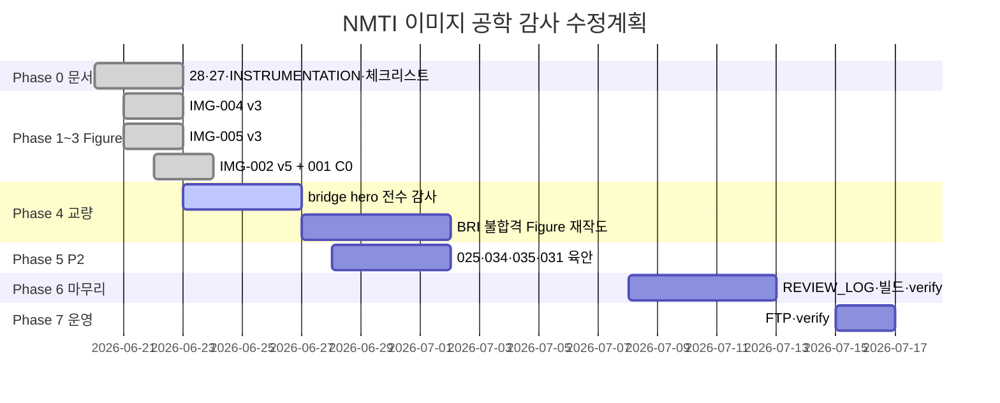

# NMTI 기술자료 이미지 — 공학 감사 수정계획 (Master Plan)

**수립:** 2026-06-22  
**근거:** [28-공학감사보고서](./28-NMTI-건설계측-기술자료-이미지-공학-감사-보고서.md) · [25-오류식별·Phase](./25-NMTI-계측-이미지-도면-오류-식별-및-수정계획-보고서.md) · [30-외부공학검증대조](./30-NMTI-건설계측-기술자료-외부공학검증-대조-및-수정계획.md)  
**목적:** Figure·콘텐츠·registry·배포의 **실행 순서·Exit·담당**을 한 문서에서 관리  
**갱신:** 본 문서가 **Living Plan** — Phase 완료 시 §2·§3 상태표만 갱신

---

## 0. Executive summary

| 구분 | 내용 |
|------|------|
| **완료** | Phase 0~8 · Phase **7.3** hero QA · **Phase Z** ZIP 10종 Figure |
| **진행** | **Phase AA** ZIP 2차 10종 · **Phase AB** ZIP 3차 10종 |
| **미착수** | — |
| **원칙** | PASS만 노출 · [30-외부검증](./30-NMTI-건설계측-기술자료-외부공학검증-대조-및-수정계획.md) · AUTO-01·CLS-01 |

**목표 완료일 (가정):** 2026-07-15 운영 반영 · `verify:production` 통과

---

## 1. 현황 매트릭스 (2026-06-22)

### 1.1 감사 ID × Figure

| 감사 ID | 대상 | 심각도 | 코드/산출 | 감사 항목 | 저장소 상태 | 잔여 |
|---------|------|--------|-----------|-----------|-------------|------|
| **EXC-05** | IMG-001·002 C0 | REGENERATE | v5·v9 Pillow | 지표면·1F·출입구 | **코드 반영** | 육안 Q0·REVIEW_LOG |
| **EXC-01** | IMG-004·002 앵커 | REGENERATE | v3·inset | 두부 조립·T/P | **코드 반영** | 002 inset=004 **일치 검수** |
| **EXC-02** | IMG-002 라벨 | MAJOR | v5 | 지중 vs 구조물 | **코드 반영** | 프롬프트·SEO caption |
| **EXC-03** | IMG-002 ②③ | MAJOR | v5·062 v2 | 관측공 vs filter | **코드 반영** | ✅ IMG-062 Pillow v2 |
| **EXC-04** | IMG-002 토압 | MAJOR | v5 | 감지면·방향 | **코드 반영** | — |
| **BLD-01~04** | IMG-005 | REGENERATE/MAJOR | v3 Pillow | 균열·θ·ATS·맥락 | **코드 반영** | REVIEW_LOG·육안 |
| **BRI-01** | `fields/bridge` | REGENERATE | — | 분야≠도면 | **012·013·014 PASS** | — |
| **BRI-02** | bridge IMG | MAJOR | Pillow v2 | generic 재사용 | **038·085~088 v2** | — |

### 1.2 registry 요약

| IMG | reviewGrade | 버전 | requiresReaudit |
|-----|-------------|------|---------------|
| 001 | PASS | Pillow v8 (+ v9 C0 동기) | false |
| 002 | PASS | v5 C0 | false |
| 004 | PASS | v3 | false |
| 005 | PASS | v3 B1~B5 | false |
| 025·034·035 | PASS | 마이그레이션 | **육안 재검수 권고** |

---

## 2. Phase 로드맵



---

## 3. Phase별 상세

### Phase 0 — 문서·기준 ✅

| # | 산출 | 상태 |
|---|------|------|
| 0.1 | [28-공학감사](./28-NMTI-건설계측-기술자료-이미지-공학-감사-보고서.md) | ✅ |
| 0.2 | [27-C0 지표면](./27-지표면-건물-안착-원칙.md) · TECHNICAL §0.3 | ✅ |
| 0.3 | INSTRUMENTATION §3.23 bridge · §2.1 감사 ID | ✅ |
| 0.4 | [29-본 수정계획](./29-NMTI-기술자료-이미지-공학-감사-수정계획.md) | ✅ |
| 0.5 | AGENTS·ImageWorks 02·REGENERATION_PROMPTS 연동 | ✅ |

**Exit:** 에이전트·작업자가 **28 §1**만 읽어도 Figure/글 작성 가능

---

### Phase 1 — P0 IMG-004 (EXC-01) ✅ 코드 / ⏳ 서명

| # | 작업 | Exit |
|---|------|------|
| 1.1 | 3분할: 단면 + **두부 확대** + T/P 원리 | PNG v3 |
| 1.2 | 반력판→LC→헤드→강연선 · T·P 분리 | doc [26](./26-IMG-004-어스앵커-하중계-오류분석-및-재작업-계획.md) R1~R4 |
| 1.3 | registry PASS · prohibitedVerified | ✅ |
| 1.4 | **잔여:** IMAGE_REVIEW_LOG §IMG-004 갱신 · 지반계측 **육안 서명** | ⏳ |

```bash
python scripts/render-retaining-audit-fixes.py --id 004
python scripts/convert-technology-webp.py --force
```

---

### Phase 2 — P1 IMG-005 (BLD-01~04) ✅ 코드 / ⏳ 서명

| # | 작업 | Exit |
|---|------|------|
| 2.1 | 균열계 **crack 교차** · anchor 양측 | BLD-01 |
| 2.2 | 구조물경사계 **θ** · 「변위」 분리 | BLD-02 |
| 2.3 | TS + CP + LoS + **복수 prism** | BLD-03 |
| 2.4 | 건물·L·영향권 주체 · 버팀보 단면 축소 | BLD-04 |
| 2.5 | 그래프 「예시 관리기준」 주석 | BLD-03 표현 위험 |
| 2.6 | **잔여:** REVIEW_LOG · doc [15 §10](./15-IMG-005-주변건물-균열경사-오류분석-및-재작업-계획.md) exit 서명 | ⏳ |

```bash
python scripts/render-retaining-audit-fixes.py --id 005
```

---

### Phase 3 — P1 IMG-002·001 (EXC-01~05) ✅ 코드 / ⏳ 서명

| # | 작업 | Exit |
|---|------|------|
| 3.1 | C0: 지표면·1F·출입구 · 지층 아래만 | [27](./27-지표면-건물-안착-원칙.md) Q0 |
| 3.2 | E1: 지중 vs 구조물경사계 라벨 | EXC-02 |
| 3.3 | E2: ② 관측공 ≠ ③ filter | EXC-03 |
| 3.4 | E3: ④ 토압 감지면·방향 | EXC-04 |
| 3.5 | E4: ⑥ 앵커 inset = IMG-004 조립 | EXC-01 |
| 3.6 | v3b 회귀 금지: 배면·앵커←·G.W.L·SOE | doc [19](./19-IMG-002-흙막이-계측-대표-단면도-오류분석-및-재작업-계획.md) |
| 3.7 | IMG-001 동일 C0 물리 (가시설) | Pillow v9 |
| 3.8 | **잔여:** 프롬프트 v7→v8 caption · SEO alt · REVIEW_LOG | ⏳ |

```bash
python scripts/render-retaining-audit-fixes.py --id 002
python scripts/render-p1-blockers.py --id 001
```

**육안 체크리스트:** [IMAGE_AUDIT_CHECKLIST §4.1·§4.1.1](./IMAGE_AUDIT_CHECKLIST.md)

---

### Phase 4 — P1 교량 `fields/bridge` (BRI-01·02) ✅

| # | 작업 | 담당 | Exit |
|---|------|------|------|
| 4.1 | `dictionary.js` bridge `imageId` **전수 목록** | FE | ✅ |
| 4.2 | 각 PNG **육안**: 교량 부재 vs 굴착 템플릿 | 구조/교량 검토 | ✅ BRI-01 **0건** |
| 4.3 | `node scripts/audit-image-doc-mismatch.mjs` · bridge field 규칙 추가 | FE | ✅ BRI-01 자동 flag |
| 4.4 | 불합격 hero **REGENERATE** (038·085~088 Pillow v2) | 디자인/CAD | ✅ `bridge_draw.py` |
| 4.5 | `categories.mjs` bridge `sectionImages` (필요 시 principle hero 지정) | 콘텐츠 | — (현행 유지) |
| 4.6 | SEO `technology/fields/bridge/` og:image 검증 | FE | ✅ `verify-deploy` BRI-01 · `verify:production` ×3 |

**bridge imageId (저장소):**

| nodeId | imageId | 감사 포인트 |
|--------|---------|-------------|
| `fields/bridge/pier` | IMG-012 | 교각·경사계 부착 |
| `fields/bridge/abutment` | IMG-038 | 교대 |
| `fields/bridge/foundation-settlement` | IMG-013 | 침하 |
| `fields/bridge/expansion-joint` | IMG-014 | 신축이음 |
| `fields/bridge/vibration` | IMG-086 | 진동 |
| `fields/bridge/temperature` | IMG-088 | 온도 |
| `fields/bridge/seismic` | IMG-087 | 지진 |
| `fields/bridge/deck-displacement` | IMG-085 | 종·횡변위·ATS |

**금지:** IMG-001·002·005를 bridge 노드에 바인딩 · 흙막이 단면을 bridge og:image로 사용

**Exit:** §4.14 체크리스트 전항 PASS · BRI-01·02 registry notes

---

### Phase 5 — P2 센서 상세 Figure ✅ **완료** (2026-06-22)

> `render-phase5-sensors.py` · `render-phase5-remainder.py` · [30 §4](./30-NMTI-건설계측-기술자료-외부공학검증-대조-및-수정계획.md)

| ID | 감사 연계 | 확인 포인트 | 상태 |
|----|-----------|-------------|------|
| **IMG-025** | EXC-02·AUTO-01 | IPI·4홈·Base·logger chain | ✅ Pillow v2 |
| **IMG-027** | EXC-02 | 안정층 · groove · grout | ✅ Pillow v2 |
| **IMG-030** | EXC-03·AUTO-01 | well cap·screen·seal·logger | ✅ Pillow v2 |
| **IMG-031** | EXC-03·AUTO-01 | filter·seal·junction·≠ standpipe | ✅ Pillow v2 |
| **IMG-034** | EXC-04 | 감지면·배면→구조물 | ✅ Pillow v2 |
| **IMG-035** | STR-01·EXC-01 | strut vs anchor 분리 | ✅ Pillow v2 |
| **IMG-062** | EXC-03 | 002 ②③ 이형 | ✅ Pillow v2 |

**절차:** IMAGE_AUDIT_CHECKLIST 해당 § → 불합격 시 `requiresReaudit: true` → Phase 1~3 워크플로 재진입

---

### Phase 6 — 검수 기록·빌드·로컬 게이트 ✅ (2026-06-22)

| # | 작업 | 상태 |
|---|------|------|
| 6.1 | IMAGE_REVIEW_LOG — 001·002·004·005 formal | ✅ |
| 6.2 | registry·master caption·content-data | ✅ |
| 6.3 | `npm run build:images` | ✅ |
| 6.4 | `npm run build:all` | ✅ |
| 6.5 | `npm run verify:local` | ✅ |

**Exit:** `audit:images:strict` **0 error** · heroes OK

---

### Phase 7 — 배포·운영 ✅ (2026-06-22)

| # | 작업 | 상태 |
|---|------|------|
| 7.1 | `npm run verify:deploy` | ✅ (+ Phase 5 PNG·WebP) |
| 7.2 | `npm run verify:production` | ✅ **24/24** |
| 7.3 | bridge·retaining hero 브라우저 육안 | ✅ `capture:hero-screenshots` · `docs/qa-screenshots/` |
| 7.4 | [10-운영가이드](./10-최종-완료-및-운영-가이드.md) §4.3 | ✅ 24 checks |

---

### Phase Z — 외부 ZIP 신규 심각 10종 (2026-06-26) ✅

**정본:** [77-외부-ZIP-전수검수](./77-외부-ZIP-전수검수-신규-심각오류-10종-및-수정계획.md) · [IMAGE_REGENERATION_PROMPTS §ZIP](./IMAGE_REGENERATION_PROMPTS.md)

| Sub | 대상 | 판정 | Exit |
|-----|------|------|------|
| Z-1 | IMG-008 · 015 · 032 · 078 · 080 | **REGENERATE** | ✅ Pillow · `verify:production` |
| Z-2 | IMG-009 · 034 · 041 · 043 · 060 | MAJOR_FIX | ✅ |
| Z-3 | ZIP 110 메타 | 2차 스캔 | ✅ [78](./78-ZIP-207-2차-전수검수-보고서.md) |

### Phase AA — ZIP 2차 묶음 신규 심각 10종 (2026-06-26) 🔄

**정본:** [81-Phase AA](./81-외부-ZIP-신규-심각오류-10종-Phase-AA-수정계획.md) · `ZIP-AUD-11`~`20` · **INTERP-01**

| Sub | 대상 | 판정 | Exit |
|-----|------|------|------|
| AA-1 | IMG-016 · 017 · 021 · 039 | **REGENERATE** | redline 0 · `requiresReaudit: false` |
| AA-2 | IMG-018 · 020 · 025 · 027 · 037 · 038 | MAJOR_FIX | Pillow/AI v+1 |
| AA-3 | registry·문서 | — | `patch:registry-phase-aa` ✅ |

**원칙:** 해석·추정·상관 Figure — **확정·인과 단정 금지** (INTERP-01).

### Phase AB — ZIP 3차 묶음 신규 심각 10종 (2026-06-26) 🔄

**정본:** [84-Phase AB](./84-외부-ZIP-신규-심각오류-10종-Phase-AB-수정계획.md) · `ZIP-AUD-21`~`30`

| Sub | 대상 | 판정 | Exit |
|-----|------|------|------|
| AB-1 | IMG-028 · 029 · 045 | **REGENERATE** | IPI-MEAS · LOGGER-SIG |
| AB-2 | IMG-026 · 030 · 035 · 040 · 042 · 044 · 046 | MAJOR_FIX | AXIS · WELL · ATS · GW |
| AB-3 | registry | — | `patch:registry-phase-ab` ✅ |

---

## 4. 담당 (역할 가정)

| 역할 | Phase | 책임 |
|------|-------|------|
| **PM/콘텐츠** | 전체 | 일정·승인·REVIEW_LOG |
| **지반 계측 검토** | 1~3·5 | EXC·BLD·025·034·031 |
| **구조/교량 검토** | 4·5 | BRI·012~088 |
| **디자인/CAD** | 4·5 | REGENERATE Figure |
| **FE/Repo** | 4~7 | registry·audit·빌드·배포 |

---

## 5. 검수 Exit 공통 (모든 Phase)

1. [28 §2](./28-NMTI-건설계측-기술자료-이미지-공학-감사-보고서.md) 해당 **감사 ID 0건**
2. [INSTRUMENTATION](./INSTRUMENTATION_DRAWING_RULES.md) 해당 § **금지 0건**
3. [IMAGE_AUDIT_CHECKLIST](./IMAGE_AUDIT_CHECKLIST.md) 해당 § **전항 체크**
4. `reviewGrade`: PASS 또는 MINOR_FIX · `status`: reviewed
5. `npm run audit:images:strict` 통과

---

## 6. 재작업 트리거 (즉시 Phase 재진입)

| 트리거 | 조치 |
|--------|------|
| bridge에 excavation Figure 노출 (BRI-01) | 해당 imageId REGENERATE · `resolveImage` null |
| C0 위반 (건물·1층·지층) | 001·002·005 **즉시** REGENERATE |
| 앵커 LC 지반 내부 (EXC-01) | 004·002 inset 재작업 |
| PASS인데 외부 감사 ID 잔존 | `requiresReaudit: true` · 등급 하향 |
| audit:images:strict 실패 | 배포 **중단** |

---

## 7. 연계 문서

| 문서 | 용도 |
|------|------|
| [28-공학감사](./28-NMTI-건설계측-기술자료-이미지-공학-감사-보고서.md) | 기준·감사 ID·§8 프롬프트 |
| [25-오류식별](./25-NMTI-계측-이미지-도면-오류-식별-및-수정계획-보고서.md) | §2 기준표·역사 Phase |
| [19·26·15·27](./19-IMG-002-흙막이-계측-대표-단면도-오류분석-및-재작업-계획.md) | IMG별 exit |
| [IMAGE_REGENERATION_PROMPTS](./IMAGE_REGENERATION_PROMPTS.md) | 재생성 프롬프트 |
| [81-Phase AA](./81-외부-ZIP-신규-심각오류-10종-Phase-AA-수정계획.md) | ZIP-AUD-11~20 · INTERP-01 |

---

## 8. 변경 이력

| 일자 | 내용 |
|------|------|
| 2026-06-26 | **Phase AB** — ZIP 3차 10종 [84](./84-외부-ZIP-신규-심각오류-10종-Phase-AB-수정계획.md) |
| 2026-06-26 | **Phase AA** — ZIP 2차 10종 [81](./81-외부-ZIP-신규-심각오류-10종-Phase-AA-수정계획.md) |
| 2026-06-26 | **Phase Z** — 외부 ZIP 207종 · 신규 심각 10종 [77](./77-외부-ZIP-전수검수-신규-심각오류-10종-및-수정계획.md) |
| 2026-06-26 | [30-외부검증](./30-NMTI-건설계측-기술자료-외부공학검증-대조-및-수정계획.md) 연동 · Phase 5~8 |
| 2026-06-22 | Phase 4 완료 — bridge 8종 BRI 감사 · 038·085~088 Pillow v2 · audit BRI-01 rule |
| 2026-06-22 | 신규 — 28 감사 반영 Master Plan · Phase 0~7 · BRI-01 잔여 명시 |
