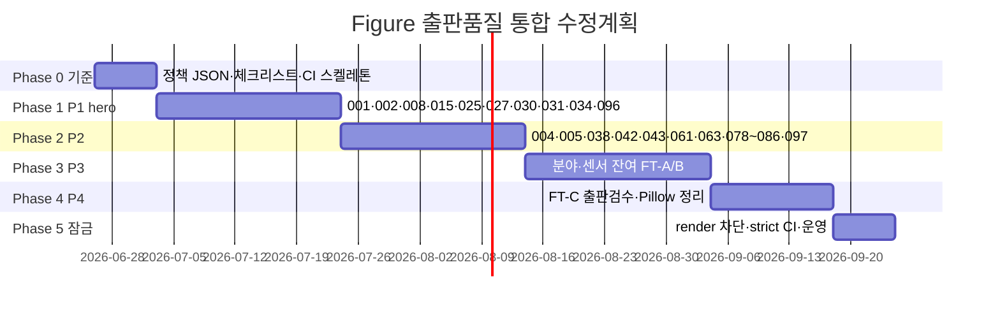

# NMTI 기술자료 Figure — 출판 품질·제작 방식 통합 수정계획

**수립:** 2026-06-26  
**근거:** IMG-008 출판 품질 이슈 분석 · [16-에이전트-SVG-생성-금지](./16-기술자료-이미지-에이전트-SVG-생성-금지.md) · [29-공학감사-Master-Plan](./29-NMTI-기술자료-이미지-공학-감사-수정계획.md)  
**정책 정본:** `scripts/figure-production-policy.json`  
**목적:** **88+2 Figure 전체**에 「허접한 Pillow 와이어프레임」 재발 방지 — **제작 방식·출판 품질·CI**를 한 체계로 통합

> **한 줄:** 공학 PASS만으로는 부족하다. **FT-A/B는 CAD·검수 AI PNG만**, **FT-C만 Pillow 허용**, **기술 게이트 + 출판 게이트** 이중 통과 후에만 `reviewed`.

---

## 0. Executive summary

| 구분 | 현황 | 목표 |
|------|------|------|
| registry | 90종 PASS (일괄 마이그레이션 다수) | **출판 검수 서명** 필수 |
| 제작 | Pillow `*_draw.py` **~52종** 단면·복합까지 담당 | FT-A/B **외부 PNG**로 이전 |
| audit | `audit:images` = 메타·키워드 | **+ `audit:figure-production`** |
| 정책 문서 | TECHNICAL §0.1 Pillow 단면 금지 | **CI·registry·Cursor 규칙**으로 강제 |

**예상 일정:** Phase 0 (1주) → P1 hero (3주) → P2~P4 순차 (8~10주)  
**담당:** 기술 검수자(공학) + 출판 검수자(시각) + 개발(CI)

---

## 1. 문제 정의

### 1.1 관찰

- IMG-008 등 Pillow Figure = **PPT 와이어프레임** 수준 (빈 그래프·상자 Kit·저해상 로거)
- IMG-002·027·031 등 **동일 파이프라인** — 공학 assert는 통과해도 **계측관리계획서 삽입 품질 미달**
- [29](./29-NMTI-기술자료-이미지-공학-감사-수정계획.md) Phase 5~6에서 **Pillow v2 일괄 PASS** → 출판 품질 게이트 없음

### 1.2 근본 원인

| # | 원인 |
|---|------|
| R1 | **정책(금지) ≠ 실행(Pillow mass render)** |
| R2 | `audit:images`가 **시각·제작방식 미검사** |
| R3 | `reviewGrade: PASS` = **기술 키워드 PASS**에 가까움 |
| R4 | 에이전트·개발자가 `render-*.py` **재실행 경로**가 열려 있음 |
| R5 | ImageWorks 프롬프트는 있으나 **redline·출판 체크리스트** 미연동 |

### 1.3 본 계획과 기존 Master Plan 관계

| 문서 | 역할 |
|------|------|
| [28-공학감사](./28-NMTI-건설계측-기술자료-이미지-공학-감사-보고서.md) | **무엇이 틀렸는가** (위치·방향·클래스) |
| [29-Master-Plan](./29-NMTI-기술자료-이미지-공학-감사-수정계획.md) | 공학 감사 **Phase 0~8** (대부분 ✅) |
| **본 문서 (31)** | **어떻게 그릴 것인가** + **얼마나 예쁘게** — **전 Figure 제작·출판 게이트** |

---

## 2. Figure Tier (FT) — 제작 방식 분류

모든 IMG-###에 **단일 tier**를 부여한다. 정본: `scripts/figure-production-policy.json`.

| Tier | 정의 | 허용 제작 | 금지 | 대표 |
|------|------|-----------|------|------|
| **FT-A** | **단면·설치 CAD** — 지반·구조·센서 물리 배치 | `cad`, `ai-reviewed` | pillow, agent-svg, 1-shot AI | 001·002·027·030·031 |
| **FT-B** | **복합 개념도** — 단면+인셋·다패널·터널 지보 복합 | `cad`, `ai-reviewed` | pillow, agent-svg, 1-shot AI | 008·078·079·025·043 |
| **FT-C** | **블록·흐름·그래프·UI** — 단면 CAD 아님 | `pillow`, `cad`, `ai-reviewed` | agent-svg | 045·048·058·070~077 |

### 2.1 제작 방식 코드

| 코드 | 의미 |
|------|------|
| `cad` | 인간 CAD / Illustrator / Inkscape → PNG ≥1920×1080 |
| `ai-reviewed` | ImageWorks 프롬프트 + **redline** + 인간 기술·출판 검수 |
| `pillow` | `scripts/lib/*_draw.py` — **FT-C만** |
| `agent-svg` | **전면 금지** ([16](./16-기술자료-이미지-에이전트-SVG-생성-금지.md)) |
| `one-shot-ai` | redline·체크리스트 없이 GenerateImage — **금지** |

### 2.2 Non-negotiable (에이전트·개발자)

```text
FT-A·FT-B Figure를 Pillow·render-*.py로 신규 생성·덮어쓰기 하지 않는다.
PASS = 기술 게이트 + 출판 게이트 + productionMethod 정합.
```

---

## 3. 이중 게이트 — 기술 PASS ≠ 출판 PASS

### 3.1 기술 게이트 (기존 — 유지)

- [IMAGE_AUDIT_CHECKLIST](./IMAGE_AUDIT_CHECKLIST.md) §3·§4
- [28-공학감사](./28-NMTI-건설계측-기술자료-이미지-공학-감사-보고서.md) 감사 ID
- `prohibitedErrors` 대조 · `validate-terminology.mjs`

### 3.2 출판 게이트 (신규 — 필수)

[IMAGE_AUDIT_CHECKLIST](./IMAGE_AUDIT_CHECKLIST.md) **§5.1 출판 품질** 참조.

| ID | 질문 | 불합격 예 |
|----|------|-----------|
| **V1** | 100%·**200%** 확대 시 라벨·선명도 OK? | Pillow 계단·번짐 |
| **V2** | **빈 패널·축만** 있는 그래프 없음? | IMG-008 ΔX/ΔY |
| **V3** | Kit/센서가 **빈 상자 3개** 수준이 아님? | 추상 블록만 |
| **V4** | 계측관리계획서·시방서 **삽입 가능** 수준? | PPT 와이어프레임 |
| **V5** | `figureTier` ↔ `productionMethod` **일치**? | FT-A + pillow |
| **V6** | redline 대비 **치수·라벨·측점** 일치? | 프롬프트와 PNG 불일치 |
| **V7** | hero Figure에 **현장명·브랜드·얼굴** 없음? | 기존 §3 공통 |

**운영 규칙:** `visualReview.grade`가 PASS/MINOR_FIX가 아니면 `reviewGrade`를 PASS로 올리지 않는다.

### 3.3 registry 확장 필드 (Phase 0)

`scripts/image-review-registry.json` 각 id에 추가:

```json
{
  "figureTier": "FT-A",
  "productionMethod": "ai-reviewed",
  "productionMethodTarget": "ai-reviewed",
  "migrationPhase": "P1",
  "visualReview": {
    "grade": "PASS",
    "reviewer": "실명",
    "date": "2026-06-26",
    "checklist": "IMAGE_AUDIT_CHECKLIST §5.1"
  }
}
```

**금지:** `reviewer: "일괄 마이그레이션"`으로 신규 PASS.

---

## 4. 전 Figure 인벤토리 요약

**총 90종** (IMG-001~088 + 096·097). 상세 tier·스크립트: `scripts/figure-production-policy.json`.

### 4.1 마이그레이션 필요 (FT-A/B + 현재 pillow) — **52종**

Pillow `render-*.py`로 생성 중이며 **외부 PNG로 교체** 대상:

| 그룹 | ID |
|------|-----|
| 가시설·흙막이 | 001·002·004·005·062·096 |
| 터널 | 008·078·079 |
| 사면 | 015 |
| 센서 설치 | 025·027·030·031·034·035·037·038·042 |
| GNSS·항만 | 043·064 |
| 분야 hero | 080~088 |
| (035·062 등 Phase5) | 위 표 포함 |

### 4.2 Pillow 유지 가능 (FT-C) — **20종**

출판 게이트(V1~V4) 적용 후 유지·개선:

`006` · `045` · `047` · `048` · `056` · `058` · `065`~`069` · `070`~`077`

### 4.3 제작 경로 미상 (unknown) — **18종**

Pillow 스크립트 없음 — **출판 검수** 후 `productionMethod` 확정:

`003` · `007` · `009`~`014` · `016`~`024` · `026` · `028` · `032` · `033` · `036` · `039`~`041` · `044` · `046` · `049`~`055` · `057` · `059` · `060` · `061` · `063` · `097`

> unknown도 FT tier에 따라 pillow **금지** 여부가 결정됨. FT-A/B면 `ai-reviewed`로만 승격.

---

## 5. Phase 로드맵



### Phase 0 — 기준·도구 (1주) ✅

| # | 작업 | 산출 | Exit |
|---|------|------|------|
| 0.1 | 본 문서 · `figure-production-policy.json` | ✅ | — |
| 0.2 | IMAGE_AUDIT_CHECKLIST **§5.1 출판 품질** | ✅ | V1~V7 |
| 0.3 | TECHNICAL_IMAGE_STANDARD **§0.5 이중 게이트** | ✅ | — |
| 0.4 | `scripts/audit-figure-production.mjs` | ✅ | warn/strict |
| 0.5 | `scripts/seed-figure-production-registry.mjs` | ✅ | 90종 tier |
| 0.6 | `.cursor/rules/no-pillow-section-figures.mdc` | ✅ | — |
| 0.7 | AGENTS.md · `render_guard.py` · render 스크립트 가드 | ✅ | — |

```bash
node scripts/audit-figure-production.mjs          # 신규
node scripts/audit-figure-production.mjs --strict # Phase 5+
```

### Phase 1 — P1 hero·치명 노출 (3주) ✅ **완료 2026-06-26**

**체크리스트:** [32-Phase1-P1-hero-재제작-실행-체크리스트.md](./32-Phase1-P1-hero-재제작-실행-체크리스트.md) — **11/11** `ai-reviewed` · `visualReview PASS`

**대상:** dictionary hero · `image-review-priority.json` P1 + 096·097·062

| ID | FT | 작업 |
|----|-----|------|
| 001·002 | A | redline → AI/CAD PNG · [14](./14-흙막이-굴착-계측-개념도-AI-생성-가이드라인.md) §2 · [27-C0](./27-지표면-건물-안착-원칙.md) |
| 008 | B | [20-IMG-008](./20-IMG-008-터널-내공변위-오류분석-및-재작업-계획.md) · 빈 패널 제거 |
| 015 | A | 사면 활동면·IPI 전칭 |
| 025·027 | A/B | [09-IPI 표준](../ImageWorks/NMTI_Engineering_Image_Prompt_Package_v1/09_지중경사계_센서형-다단식_표현_표준.md) |
| 030·031·034 | A | EXC-03·AUTO-01 · [30](./30-NMTI-건설계측-기술자료-외부공학검증-대조-및-수정계획.md) |
| 096 | A | [18-주변지반](./18-주변지반-계측-설치-단면도-수정-계획.md) |
| 062 | A | 002 ②③ 이형 상세 |

**Figure 1장당 워크플로:**

1. ImageWorks 프롬프트 v2+ · INSTRUMENTATION 해당 §
2. **redline** (지표면·센서·Envelope·화살표) — 검수자 승인
3. AI/CAD PNG ≥1920×1080 → `assets/images/technology/source/`
4. 기술 게이트 (§4.x) + 출판 게이트 (§5.1)
5. `productionMethod: ai-reviewed` · `visualReview` 기록
6. `convert-technology-webp.py` → `generate-image-assets.mjs`

**Exit:** P1 hero 전종 `visualReview.PASS` · registry 11/11 ✅ (2026-06-26)

### Phase 2 — P2 hero·터널·교량 (3주) ✅ **완료 2026-06-26**

**체크리스트:** [33-Phase2-P2-hero-재제작-실행-체크리스트.md](./33-Phase2-P2-hero-재제작-실행-체크리스트.md) — **12/12** `ai-reviewed` · `visualReview PASS`

| ID | FT | 참조 |
|----|-----|------|
| 004·005 | A | doc 26·15 |
| 038·042·043 | A/B | BRI·GNSS book |
| 061·063 | A | 터널 천단침하·막장 분리 |
| 078·079 | B | doc 21·22 — **Pillow 폐기** |
| 085·086 | B | bridge BRI |
| 097 | B | [23-IMG-097](./23-IMG-097-터널-발파진동-영향권-오류분석-및-재작업-계획.md) |

**Exit:** P2 subset 12/12 ✅ (2026-06-26)

### Phase 3 — 분야·센서 잔여 FT-A/B (3주) — **38/38 완료** ✅ (2026-06-26)

- [34-체크리스트](./34-Phase3-FT-A-B-잔여-재제작-체크리스트.md) · `scripts/phase3-p3-figures.json`
- field-heroes 080–088(085·086 제외) · pillow 024·035·037·064·098–101 · unknown 23종

**Exit:** Phase 3 대상 38/38 `ai-reviewed` · `visualReview PASS` ✅

### Phase 4 — FT-C 정리 (2주) — **36/36 완료** ✅ (2026-06-26)

| # | 작업 | 상태 |
|---|------|------|
| 4.1 | FT-C visualReview PASS · `npm run sign:phase4` | ✅ |
| 4.2 | `enforce_composite_policy` — ai-reviewed FT-A/B 패치 금지 | ✅ |
| 4.3 | 그래프·블록 unknown → pillow | ✅ |
| 4.4 | 품질 미달 ai-reviewed 승격 | — (선택) |

- [35-체크리스트](./35-Phase4-FT-C-출판검수-체크리스트.md) · `scripts/phase4-p4-figures.json`

**Exit:** FT-C 36종 visualReview PASS · productionMethod ≠ unknown ✅

### Phase 5 — CI 잠금·운영 (1주) — **완료** ✅ (2026-06-26)

| # | 작업 | 상태 |
|---|------|------|
| 5.0 | Sprint0 089–093 → ai-reviewed | ✅ |
| 5.1 | `verify:local` + `audit:figure-production:strict` | ✅ |
| 5.2 | FT-A/B render 가드 | ✅ |
| 5.3 | composite 패치 금지 | ✅ |
| 5.4 | strict audit 0 errors | ✅ |

- [36-체크리스트](./36-Phase5-CI-잠금-체크리스트.md) · `scripts/phase5-sprint0-figures.json`

**Exit:** `audit:figure-production:strict` 0 errors · FT-A/B pillow 0건 · `verify:production` **24/24** ✅

---

## 6. CI·스크립트 변경 명세

### 6.1 `audit-figure-production.mjs` (신규)

| 검사 | 조건 |
|------|------|
| F1 | registry `figureTier` 존재 |
| F2 | `productionMethod` ∈ tier.allowedMethods |
| F3 | FT-A/B + `productionMethod: pillow` → **FAIL** |
| F4 | `reviewGrade: PASS` + `visualReview` 없음 → **FAIL** (--strict) |
| F5 | `reviewer` = `일괄 마이그레이션` + PASS → **WARN** → Phase 5 **FAIL** |
| F6 | PNG width < 1920 또는 height < 1080 → **FAIL** (hero) |
| F7 | `figure-production-policy.json`의 `renderScript` + pillow method → **WARN** |

### 6.2 `verify:local` 확장

```json
"audit:figure-production": "node scripts/audit-figure-production.mjs",
"verify:local": "... && npm run audit:figure-production"
```

Phase 0~4: 기본 **WARN**. Phase 5: `--strict` **FAIL**.

### 6.3 Pillow render 가드 (Phase 5)

`scripts/lib/render_guard.mjs` 또는 각 `render-*.py` 진입:

```python
# policy lookup — FT-A/B id면 sys.exit(2)
```

---

## 7. 역할·RACI

| 활동 | 기술 검수 | 출판 검수 | 디자인/CAD | 개발 |
|------|-----------|-----------|------------|------|
| redline 승인 | R/A | C | C | — |
| AI/CAD PNG | C | C | R/A | — |
| 기술 게이트 | R/A | — | — | — |
| 출판 게이트 | C | R/A | C | — |
| registry·CI | C | C | — | R/A |

---

## 8. 완료 정의 (Program Exit)

| # | 기준 |
|---|------|
| E1 | 90종 전부 `figureTier` · `productionMethod` 확정 |
| E2 | FT-A/B **pillow 0건** |
| E3 | hero·P1 **visualReview PASS** 100% |
| E4 | `npm run verify:local` — `audit:figure-production --strict` 통과 |
| E5 | `일괄 마이그레이션` reviewer **0건** (PASS 항목) |
| E6 | [10-운영가이드](./10-최종-완료-및-운영-가이드.md) · AGENTS.md 반영 | ✅ |

**Program Exit (2026-06-26):** E1–E6 충족 · `verify:local` · `verify:production` 24/24

---

## 9. 리스크·완화

| 리스크 | 완화 |
|--------|------|
| 전량 동시 재제작 불가 | **P1 hero 우선** — 나머지 `pending` 노출 차단은 선택 |
| AI 1-shot 재발 | redline 필수 · `one-shot-ai` audit 금지 |
| Pillow 스크립트 의존 개발 | Phase 5 render guard · 문서 DEPRECATED |
| 공학·출판 검수자 부족 | 체크리스트 표준화 · 200% 스크린샷 템플릿 |

---

## 10. 연계 문서

| 문서 | 역할 |
|------|------|
| [TECHNICAL_IMAGE_STANDARD](./TECHNICAL_IMAGE_STANDARD.md) | 강제 표준 |
| [16-SVG·Pillow 금지](./16-기술자료-이미지-에이전트-SVG-생성-금지.md) | 제작 금지 |
| [24-토목 계측 가이드](./24-토목-계측-개념도-및-구성도-작성-가이드라인.md) | 보고서 삽입 품질 |
| [IMAGE_AUDIT_CHECKLIST §5.1](./IMAGE_AUDIT_CHECKLIST.md) | 출판 게이트 |
| [29-Master-Plan](./29-NMTI-기술자료-이미지-공학-감사-수정계획.md) | 공학 Phase |
| `scripts/figure-production-policy.json` | **기계 판독 정본** |

---

## 11. 변경 이력

| 일자 | 내용 |
|------|------|
| 2026-06-26 | 신규 — FT-A/B/C · 이중 게이트 · 90종 인벤토리 · Phase 0~5 |
