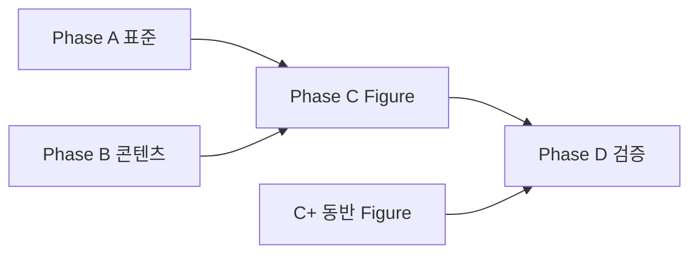

# 교량 확장 Figure 5종 통합 구현계획

**수립:** 2026-06-26  
**구현 완료:** 2026-06-26 — [73-대구 구현 완료](./73-대구통합계측-준공보고서-구현-완료-보고.md)  
**범위:** 교량 분야 **5종 hero Figure** + 연동 콘텐츠·메뉴·표준·검증  
**선행 완료:** [52-BRI-EJ](./52-교량-신축이음계-계측-표현-표준.md) · [53-IMG-014](./53-IMG-014-신축이음계-수정계획.md) · `deck-displacement` 삭제  
**세부 계획:** [58-처짐·케이블장력](./58-교량-처짐-케이블장력-신규-추가-계획.md) · [61-대구통합 갭](./61-대구통합계측-준공보고서-갭분석-추가계획.md)

> **한 줄:** 대구통합계측·회사 실적 기준으로 빠진 교량 계측 5항목(처짐·케이블장력·변형률·풍하중·받침변위)에 **전용 리프·hero Figure·표준**을 한 번에 맞추고, IMG-085 고아 Figure를 **IMG-110**으로 정리한다.

---

## 1. 범위·우선순위

### 1.1 본 계획의 5종 hero Figure (P0~P1)

| ID | 제목 | nodeId | tier | P | 근거 |
|----|------|--------|------|---|------|
| **IMG-103** | 교량 상부구조 처짐 계측도 | `fields/bridge/deflection` | FT-A | **P0** | 대구 §5.3.6 L/600 · KDS §4.2.1.6 |
| **IMG-105** | 교량 케이블 장력 계측도 | `fields/bridge/cable-tension` | FT-A | **P0** | 금호강·경관·신천사장 장력계 · 회사 핵심 사업 |
| **IMG-107** | 교량 변형률·응력 계측도 | `fields/bridge/strain-stress` | FT-A | **P1** | 준공보고서 전 공구 변형률계 · PSC 휨응력 |
| **IMG-109** | 교량 풍하중·풍향풍속 계측도 | `fields/bridge/wind` | FT-A | **P1** | 주탑교 RM Young · 동적 거동 |
| **IMG-110** | 교량 받침부 변위 계측도 | `fields/bridge/bearing-displacement` | FT-A | **P1** | 삭제된 종·횡변위 대체 · IMG-085 정리 |

### 1.2 동반 Figure (Phase 2 — hero Exit 후)

| ID | 제목 | nodeId | tier | P |
|----|------|--------|------|---|
| IMG-104 | 처짐계 설치·측정 개념도 | `sensors/deflection-gauge` | FT-B | P1 |
| IMG-106 | 케이블장력계 설치 개념도 | `sensors/cable-tension-meter` | FT-B | P1 |
| IMG-108 | 무응력계 설치 개념도 | `sensors/stress-free-strain-gauge` | FT-B | P2 |

### 1.3 범위 외 (별도 트랙)

| 항목 | 사유 |
|------|------|
| IMG-011 v2 (교량 전체 개념도) | ✅ [74](./76-IMG-011-교량-전체-개념도-v2-수정계획.md) · 10종 callout |
| pier 주탑 FAQ · alarm 1차/2차 기준 | [61](./61-대구통합계측-준공보고서-갭분석-추가계획.md) Phase 4 |
| SVG·에이전트 단면 생성 | [16](./16-기술자료-이미지-에이전트-SVG-생성-금지.md) 금지 |

---

## 2. 현황 대조 (2026-06-26)

### 2.1 완료·부분 완료

| 항목 | 상태 | 비고 |
|------|------|------|
| `deck-displacement` 삭제 | ✅ | 종·횡변위 리프 제거 |
| `expansion-joint` + IMG-014 v2.1 | ✅ | BRI-EJ · PASS |
| `dictionary.js` 교량 메뉴 10리프 | △ | strain·deflection·cable·wind **메뉴만** |
| `dictionary.js` imageId 103~109·104·106·108 | △ | **콘텐츠·PNG 없음** → hero 미노출 |
| `sensors/deflection-gauge` · `cable-tension-meter` · `stress-free-strain-gauge` | △ | 트리만 · `sensors.mjs` **없음** |
| `KEYWORD_MAP` `처짐계` → `deflection-gauge` | ✅ | G-08 해소 |
| `categories.mjs` purpose 「처짐」 문구 | △ | 변형률·풍하중·케이블 행 **미반영** |

### 2.2 미완료 (본 계획 필수)

| 항목 | 상태 |
|------|------|
| `fields/bridge/bearing-displacement` | ❌ 메뉴·콘텐츠·imageId 없음 |
| `leaves-part2.mjs` 신규 5리프 본문 | ❌ |
| `sensors.mjs` deflection-gauge · cable-tension-meter · stress-free | ❌ |
| 표준 문서 BRI-DEF · BRI-CT · BRI-STR · BRI-WND · BRI-BRG | ❌ |
| INSTRUMENTATION §3.23.4~8 | ❌ |
| IMG-103~110 레지스트리·PNG | ❌ (최고 등록 ID: IMG-102) |
| IMG-085 | ⚠️ **고아** — 「종·횡변위」 PASS이나 node 바인딩 없음 |
| ImageWorks master list 103~110 | ❌ |
| SEO 정적 페이지 5리프 | ❌ |
| `img-node-map.mjs` · audit 스크립트 | ❌ 신규 ID 반영 필요 |

### 2.3 목표 아키텍처

**교량 리프 (7 → 11)**

```text
교각 → 교대 → 기초침하 → 변형률·응력 → 처짐 → 신축이음량 → 케이블 장력
  → 받침부 변위 → 풍하중 → 진동 → 온도 → 지진
```

**센서 (17 → 20)** — 풍향풍속 전용 노드는 **생략** (`weather-station` + `bridge/wind`)

```text
+ deflection-gauge · cable-tension-meter · stress-free-strain-gauge
```

**노드 수:** 약 113 → **118** (리프 +5, 센서 +3, bearing +1, deck-displacement −1 이미 반영 시 +4 순증)

---

## 3. 표준 문서 번호 (충돌 해소)

[58](./58-교량-처짐-케이블장력-신규-추가-계획.md) 초안의 `docs/59`·`docs/60`은 **이미 타 주제에 사용 중**이다.

| 코드 | 산출물 파일 | 내용 |
|------|-------------|------|
| **BRI-DEF** | `docs/65-교량-처짐-계측-표현-표준.md` | DEF-BRI-01~12 · 침하계 금지 · δ·L/xxx |
| **BRI-CT** | `docs/66-교량-케이블장력-계측-표현-표준.md` | CT-BRI-01~12 · 진동현식·f→T · 로드셀 금지 |
| **BRI-STR** | `docs/62-교량-변형률-응력-계측-표현-표준.md` | STR-BRI-01~12 · PSC 휨·전단 inset · 침하 금지 |
| **BRI-WND** | `docs/63-교량-풍하중-계측-표현-표준.md` | WND-BRI-01~12 · 주탑·교면 · 풍속 벡터 |
| **BRI-BRG** | `docs/67-교량-받침부-변위-계측-표현-표준.md` | BRG-BRI-01~12 · 받침 슬라이드·회전 · GNSS/3축 혼동 금지 |

각 표준마다 대응 **IMG 수정계획** (`docs/68~72-IMG-###-…-수정계획.md`) — [53-IMG-014](./53-IMG-014-신축이음계-수정계획.md) 형식.

**INSTRUMENTATION:** `docs/INSTRUMENTATION_DRAWING_RULES.md` **§3.23.4~8** 요약·Figure 바인딩 표.

---

## 4. Phase A — 표준·용어 (선행, ~1.5일)

| # | 작업 | Exit |
|---|------|------|
| A-1 | `docs/65` BRI-DEF 초안 | redline · DEF-BRI 금지표 확정 |
| A-2 | `docs/66` BRI-CT 초안 | CT-BRI 금지표 · 회사 실적 캡션만 |
| A-3 | `docs/62` BRI-STR 초안 | 전단변형률 FAQ 링크 |
| A-4 | `docs/63` BRI-WND 초안 | weather-station vs bridge/wind 구분 |
| A-5 | `docs/67` BRI-BRG 초안 | EJ-01·DEF-BRI·절대좌표 혼동 금지 |
| A-6 | INSTRUMENTATION §3.23.4~8 | 5 Figure ID 매핑 |
| A-7 | `docs/TERMINOLOGY.md` | 처짐계≠침하계 · 장력계≠하중계 · 받침변위≠신축량 |
| A-8 | `book/KDS-KCS_용어기준.md` + `kds-kcs-citation-registry.json` | 신규 nodeId 인용 |

**병행 가능:** A-1·A-2와 A-3·A-4는 독립.

---

## 5. Phase B — 메뉴·콘텐츠 (~2일)

### B-1 dictionary.js (잔여)

| 작업 | 상세 |
|------|------|
| **bearing-displacement** 추가 | 메뉴: `신축이음량` 다음 또는 `케이블 장력` 다음 권장 — **「받침부 변위」** |
| imageId | `fields/bridge/bearing-displacement` → **IMG-110** |
| relatedSensors | `displacement-transducer`, `tilt-meter`, `deflection-gauge` |
| `strain-gauge` relatedFields | `bridge/strain-stress` 이미 반영 — 유지 |
| `displacement-transducer` relatedFields | `bearing-displacement` 추가 검토 |

### B-2 leaves-part2.mjs — 5리프 본문

공통 섹션: `overview` · `purpose[]` · `principle` · `installation[]` · `dataInterpretation` · `faq[]` · `sectionImages`

| nodeId | hero | sectionImages (예) | 준공보고서 인용 |
|--------|------|-------------------|-----------------|
| `bridge/deflection` | IMG-103 | principle:103 · installation:104 | L/600 예시 · δ 그래프 |
| `bridge/cable-tension` | IMG-105 | principle:105 · installation:106 | AC-310/GV-2440 · f→T |
| `bridge/strain-stress` | IMG-107 | principle:107 · (strain-gauge 보조) | §5.3 변형률·허용응력 |
| `bridge/wind` | IMG-109 | principle:109 · weather-station 링크 | RM Young · 동적 평가 |
| `bridge/bearing-displacement` | IMG-110 | principle:110 | 받침 슬라이드·회전 vs 신축이음 |

**금지 서술:** 처짐=침하 · 케이블장력=하중계 · 받침변위=종횡 3축 GNSS · 풍하중=사면 기상 hero.

### B-3 sensors.mjs — 3센서

| nodeId | imageId | 핵심 구분 |
|--------|---------|-----------|
| `deflection-gauge` | IMG-104 | ≠ `settlement-gauge` |
| `cable-tension-meter` | IMG-106 | ≠ `load-cell` |
| `stress-free-strain-gauge` | IMG-108 | 온도·크리프 보정 · `strain-gauge` 연계 |

### B-4 기타 메타

| 파일 | 작업 |
|------|------|
| `categories.mjs` | purpose: 변형률·응력 · 케이블 장력 · 풍하중 · 받침부 변위 행 |
| `tree-icons.js` | bridge 하위 5종 아이콘 (기존 패턴) |
| `build-content-data.mjs` | customizeLeaf 필요 시 |
| `generate-technology-seo-pages.mjs` | 5리프 SEO 생성 |
| `verify-production.mjs` | expansion-joint 패턴으로 URL 체크 추가 |

### B-5 빌드 중간 검증

```bash
node scripts/validate-terminology.mjs
node scripts/build-content-data.mjs
node scripts/generate-technology-seo-pages.mjs
```

**Exit:** 5리프 + 3센서 `content-data.js` 존재 · hero imageId 지정 · terminology 0 error.

---

## 6. Phase C — Figure 제작 (~3~4일)

### C-0 공통 워크플로

```text
1. BRI-XXX 표준 + docs/68~72 IMG 수정계획 확정
2. ImageWorks/.../prompts/IMG-###_*.md v1
3. 01_IMAGE_MASTER_LIST.csv · 03_IMAGE_MASTER_LIST.json 행 추가
4. AI/CAD PNG ≥1920×1080 → assets/.../source/ + 본경로
5. node scripts/register-external-figure.mjs --id IMG-### …
   (네트워크 드라이브: source/ 복사본을 입력으로 — IMG-014 EBUSY 교훈)
6. convert-technology-webp.py → npm run build:images
7. scripts/lib/img-node-map.mjs · audit-image-doc-mismatch.mjs
8. reviewGrade PASS · prohibitedVerified · requiresReaudit false
```

**금지:** SVG Figure · `render-svg-figures.py` · 임의 관리기준 mm/kN 고정표.

### C-1 IMG-103 — 처짐 (BRI-DEF)

| 뷰 | 필수 |
|----|------|
| 단면 | PSC 박스 또는 강거더 · 교각 · **받침** · mid-span |
| 계측 | 처짐계(LVDT/ring) 거더 하연 · (보조) 프리즘+ATS |
| 측정량 | **처짐량 δ(mm)** · **L/xxx (예시)** |
| 금지 | 침하판·지반 성토 · Y축 「침하량」 · IMG-099 건축 단면 재사용 |

**프롬프트:** `ImageWorks/.../prompts/IMG-103_교량_상부구조_처짐_계측도.md`

### C-2 IMG-105 — 케이블 장력 (BRI-CT)

| 뷰 | 필수 |
|----|------|
| 입면 | 사장교 또는 현수교 · 타워 · 주케이블 |
| 계측 | 진동현식 센서 · **주파수 f** |
| 측정량 | **장력 T(kN)** · 그래프 예시 |
| 금지 | IMG-004 앵커 로드셀 · 흙막이 배경 · 케이블 없는 단순교만 |

### C-3 IMG-107 — 변형률·응력 (BRI-STR)

| 뷰 | 필수 |
|----|------|
| 단면 | PSC 박스 또는 강재 거더 |
| 계측 | 변형률계 매립 · (inset) 전단부 3축 |
| 측정량 | 휨응력 σ · 변형률 ε |
| 금지 | 침하계 · 터널 숏크리트 hero(079) 혼용 |

### C-4 IMG-109 — 풍하동 (BRI-WND)

| 뷰 | 필수 |
|----|------|
| 입면/단면 | 주탑 또는 교면 난간 |
| 계측 | 풍향풍속 센서 · **풍속 벡터** |
| 보조 | 진동계(동적 상관) — 주계측 아님 |
| 금지 | 사면 IMG-015 기상 hero 재사용 · 풍하중 수치 관리표 |

### C-5 IMG-110 — 받침부 변위 (BRI-BRG) · IMG-085 처리

**전략 (권장):** IMG-085 **폐기·아카이브** → IMG-110 **신규 제작** (제목·개념 전면 교체).

| v1 IMG-085 문제 | v2 IMG-110 목표 |
|-----------------|-----------------|
| 「종·횡변위」 3축 혼합 | **받침부** 상대 변위(슬라이드·회전) |
| deck-displacement 바인딩 | `bearing-displacement` 전용 |
| 신축이음·GNSS 혼동 | BRI-EJ·BRI-DEF와 **명시적 구분** 캡션 |

| 뷰 | 필수 |
|----|------|
| 단면 | 거더·**받침**(고정/이동) · 교각 상부 |
| 계측 | 변위계/LVDT 받침 상·하부 · (선택) 경사 |
| 측정량 | 슬라이드(mm) · 회전(rad 또는 ‰) |
| 금지 | X/Y/Z 3축 주표기 · 신축이음 핑거형 · 절대 GNSS 좌표 |

**레지스트리:** IMG-085 `status: deprecated` 또는 `reviewGrade: FAIL` + `supersededBy: IMG-110` — `resolveImage()` 미노출 확인.

### C-6 동반 Figure (Phase C+)

| ID | 요지 |
|----|------|
| IMG-104 | LVDT·ring — 침하판 **없음** |
| IMG-106 | 피아노선·f→T — 앵커 로드셀 **없음** |
| IMG-108 | 동일 콘크리트 매립 · 「응력 0」 캡션 |

### C-7 Figure Exit

| 체크 | 기준 |
|------|------|
| 5 hero | IMG-103·105·107·109·110 **PASS** · hero 바인딩 일치 |
| 동반 3종 | IMG-104·106·108 PASS (P1~P2) |
| audit | `npm run audit:images:strict` · `validate:heroes` 0 error |
| IMG-085 | 고아 해소 · 운영 페이지 미노출 |

---

## 7. Phase D — 빌드·검증·문서 (~0.5일)

```bash
npm run build:images
node scripts/build-content-data.mjs
node scripts/generate-technology-seo-pages.mjs
node scripts/generate-sitemap-technology.mjs
npm run validate:terminology
npm run validate:citations
npm run audit:images:strict
npm run validate:heroes
npm run verify:local
```

| 산출물 | 갱신 |
|--------|------|
| `docs/IMAGE_REVIEW_LOG.md` | 103~110 항목 |
| `docs/IMAGE_AUDIT_CHECKLIST.md` | BRI-DEF/CT/STR/WND/BRG 게이트 |
| `docs/10-최종-완료-및-운영-가이드.md` | 노드·IMG 카운트 |
| `AGENTS.md` | 5종 hero 한 줄 |
| `docs/07-미구현-백로그.md` | G-01~G-05 완료 체크 |

---

## 8. 의존성·일정



| Phase | 내용 | 공수 | 의존 |
|-------|------|------|------|
| **A** | 표준 5종 + INSTRUMENTATION | 1.5일 | — |
| **B** | 메뉴 잔여 + 콘텐츠 8노드 | 2일 | A 병행 가능 |
| **C** | hero 5종 PNG·등록 | 3일 | A-1~5 최소 초안 |
| **C+** | 센서 Figure 104·106·108 | 1일 | C hero |
| **D** | verify:local · 문서 | 0.5일 | C |
| **합계** | | **~8일** | |

**권장 순서:** A(103·105) → B(처짐·케이블) → C(103·105) → A(107·109·110) → B(나머지) → C(나머지) → C+ → D.

---

## 9. 완료 기준 (Exit Checklist) — 2026-06-26 갱신

### 9.1 메뉴·콘텐츠

- [x] 교량 리프 **11종** · 센서 **20종**
- [x] `bearing-displacement` 메뉴·SEO·콘텐츠
- [x] `validate:terminology` exit 0

### 9.2 Figure

- [x] IMG-103·105·107·109·110 **PASS** · `hero: true`
- [x] IMG-104·106·108 PASS
- [x] IMG-085 **superseded** · 미노출

### 9.3 표준·문서

- [x] BRI-DEF/CT/STR/WND/BRG — [68](./68-교량-처짐-계측-표현-표준.md)~[72](./72-교량-받침부-변위-계측-표현-표준.md)
- [x] INSTRUMENTATION §3.23.4~8
- [x] ImageWorks 프롬프트 103~110

### 9.4 검증

- [x] `npm run verify:local` OK
- [x] `npm run verify:deploy` OK · `deploy-manifest.txt` 400 paths 갱신
- [x] bearing-displacement SEO `deck-displacement` 문자열 제거 (로컬)
- [x] `npm run verify:production` **28/28** (2026-06-26 — 홈 10분야·교량 BRI 반영)
- [x] IMG-011 v2 (P3) — Pillow 10종 callout · `render-bridge-overview.py`

---

## 10. 금지·리스크

| ID | 리스크 | 대응 |
|----|--------|------|
| CLS-01 | 지중경사계·구조물경사계 혼동 | 받침 경사는 tilt-meter **보조**만 |
| AUTO-01 | 수동 probe hero | 자동형 로거·junction box |
| DEF-03 | 처짐=침하 | BRI-DEF · KEYWORD_MAP 유지 |
| EJ-01 | 받침변위=신축 3축 | BRI-BRG · IMG-110 전용 |
| CT-01 | 케이블=앵커 로드셀 | BRI-CT · IMG-004 분리 |
| NET-01 | RaiDrive EBUSY | register 시 `source/` 입력 |
| DOC-01 | docs/59·60 번호 충돌 | **65~67** 사용 (본 계획 §3) |

---

## 11. 구현 시 파일 체크리스트

| 구분 | 파일 |
|------|------|
| 표준 | `docs/62` `63` `65` `66` `67` |
| IMG 계획 | `docs/68`~`72` (선택) |
| 콘텐츠 | `leaves-part2.mjs` · `sensors.mjs` · `categories.mjs` |
| 트리 | `dictionary.js` · `tree-icons.js` |
| Figure | `assets/images/technology/IMG-10[3-9]*` · `IMG-110*` · `source/` |
| 레지스트리 | `image-review-registry.json` · `canonical-image-png.json` |
| ImageWorks | `01_IMAGE_MASTER_LIST.csv` · `prompts/IMG-###_*.md` |
| 빌드 | `images.js` · `content-data.js` · `img-node-map.mjs` |
| 검증 | `audit-image-doc-mismatch.mjs` · `verify-production.mjs` |
| 용어 | `TERMINOLOGY.md` · `KDS-KCS_용어기준.md` · `kds-kcs-citation-registry.json` |

---

## 12. 참고 문서·사례

| 문서 | 용도 |
|------|------|
| [52-BRI-EJ](./52-교량-신축이음계-계측-표현-표준.md) | 표준·Figure 분리 패턴 |
| [53-IMG-014](./53-IMG-014-신축이음계-수정계획.md) | IMG 수정계획·Exit 형식 |
| [58](./58-교량-처짐-케이블장력-신규-추가-계획.md) | 103~106 상세 |
| [61](./61-대구통합계측-준공보고서-갭분석-추가계획.md) | 갭분석·Phase 계획 |
| **[73](./73-대구통합계측-준공보고서-구현-완료-보고.md)** | **구현 완료 정본** |
| [24-토목-계측-개념도](./24-토목-계측-개념도-및-구성도-작성-가이드라인.md) | Figure 공통 |
| `book/1-150120_대구통합계측 준공보고서-본문.pdf` | 관리기준·센서 정본 |
| `book/광암교 계측계획서-수정-2.pdf` | 교량 유지관리 사례 |

---

**상태:** 2026-06-26 구현 완료 — [73-구현 완료 보고](./73-대구통합계측-준공보고서-구현-완료-보고.md) · IMG-011 v2 ✅ · `verify:production` 28/28.
