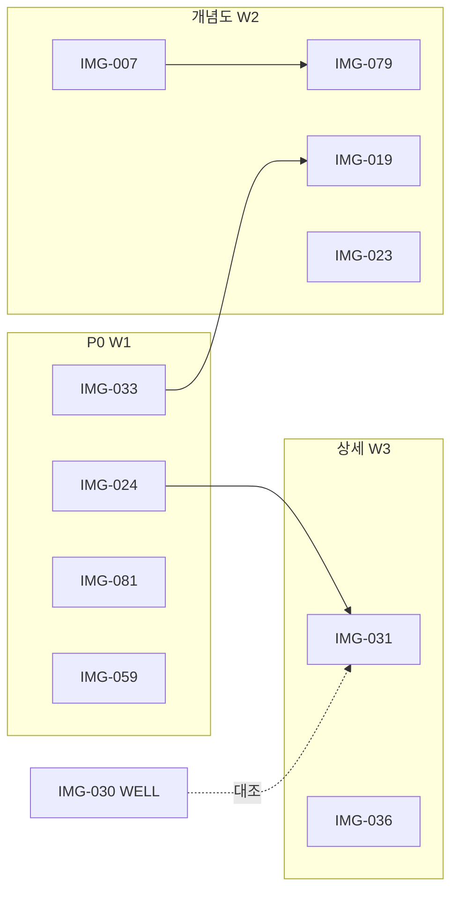

# Phase AC — 통합 수정 실행계획

**수립:** 2026-06-22  
**범위:** ZIP 4차 신규 심각 오류 **10 Figure** (`ZIP-AUD-31` ~ `ZIP-AUD-40`)  
**상위:** [92-기준표](./92-외부-ZIP-신규-심각오류-10종-Phase-AC-수정계획.md) · [82-재작도 통합](./82-Figure-재작도-통합-수정계획.md) · [89-작업순서](./89-PNG-재작도-통합-작업순서.md)  
**원칙:** **MEAS-PRIN-01** — 계측 항목별 기준점·측점·측선·단위·해석 단계 분리 ([TECHNICAL §0.0e](./TECHNICAL_IMAGE_STANDARD.md))

> **한 줄:** 문서·registry·프롬프트는 **완료** — 본 계획은 **PNG 재작도 4스프린트(약 4주)** 실행 로드맵.

---

## 0. 목표 · 성공 기준

| # | 목표 | 성공 기준 (Exit) |
|---|------|------------------|
| G1 | **공학 오해 제거** | 10종 `prohibitedErrors` 육안 **0건** |
| G2 | **히어로·노드 정합** | `audit:image-doc` · `validate:heroes` PASS |
| G3 | **registry 정상화** | 10종 `requiresReaudit: false` · `prohibitedVerified: true` |
| G4 | **CI 잠금** | `npm run verify:local` PASS |
| G5 | **문서 동기** | redline v3+ 서명 · IMAGE_REVIEW_LOG 갱신 |

**범위 외:** IMG-037·038·039 (Phase AA 잔여 MAJOR_FIX — 본 스프린트 **후속 검수**)

---

## 1. 현황 (2026-06-22)

| 항목 | 상태 |
|------|------|
| 오류 정본·기준표 | ✅ [92](./92-외부-ZIP-신규-심각오류-10종-Phase-AC-수정계획.md) |
| 복붙 프롬프트 §1~§10 | ✅ [93](./93-Phase-AC-복붙-프롬프트-정본.md) |
| IMG별 exit criteria | ✅ [95](./95-Phase-AC-IMG별-오류분석-및-재작업-계획.md) |
| registry `requiresReaudit` | ✅ `npm run patch:registry-phase-ac` 적용됨 |
| PNG 재작도 | ☐ **미착수** (10/10) — `rework:phase AC` · 제작자 PNG |
| redline 서명 | ☐ Phase AC 일괄 서명 대기 |
| `sign:phase-ac` 스크립트 | ✅ `scripts/sign-phase-ac-review.mjs` |

---

## 2. 스프린트 로드맵 (4주)

```text
Sprint AC-0 (D0)     준비·의존성 확인
Sprint AC-1 (W1)     P0 즉시 4건 REGENERATE
Sprint AC-2 (W2)     분야 개념도 4건 REGENERATE
Sprint AC-3 (W3)     센서 상세 2건 MAJOR_FIX
Sprint AC-4 (W4)     일괄 검수·서명·CI
```

### Sprint AC-0 — 준비 (0.5일)

| # | 작업 | 담당 | 산출 |
|---|------|------|------|
| 0-1 | [94 체크리스트](./94-Phase-AC-재작도-실행-체크리스트.md) 인쇄·공유 | PM | — |
| 0-2 | 현행 PNG `assets/images/technology/` 백업 | Dev | `source/_backup-AC-YYYYMMDD/` |
| 0-3 | **의존성 표** §4 확인 — 선행 Figure와 충돌 없는지 | 검수 | redline 메모 |
| 0-4 | ImageWorks `prompts/` 10종 유무 점검 — 없으면 [93](./93-Phase-AC-복붙-프롬프트-정본.md)로 신규 생성 | Dev | `prompts/IMG-###_*.md` |

---

### Sprint AC-1 — P0 즉시 4건 (W1 · 4~5일)

**이유:** 안전·해석 오해가 가장 큰 4종 — 배포 노출 시 리스크 최대.

| 순위 | ID | 작업 패키지 | 복붙 | 검수 규칙 | 예상 |
|------|-----|-------------|------|-----------|------|
| **1** | **024** | 댐 안전관리 체계도 v4 — **DAM-LEAK-01** 하류 배수계통 누수량 | [93 §4](./93-Phase-AC-복붙-프롬프트-정본.md) + [39 §12](./39-IMG-024-댐-안전관리-계측-체계도-전면-수정-계획.md) | DAM-01~03 유지 · §4.16 | 1.5일 |
| **2** | **033** | 자석링식 층별침하 — **MAG-RING-01** | [93 §6](./93-Phase-AC-복붙-프롬프트-정본.md) | SETTLE-01 대조 | 1일 |
| **3** | **081** | 기둥 축소 — **COL-SHRINK-01** | [93 §9](./93-Phase-AC-복붙-프롬프트-정본.md) | DEF-01~04 · 「예시」그래프 | 1일 |
| **4** | **059** | 관리기준 — **THRESH-01** | [93 §10](./93-Phase-AC-복붙-프롬프트-정본.md) | ZIP-AUD-08(060)와 정합 | 1일 |

**W1 Exit:**

- [ ] 4건 PNG ≥1920×1080 · `source/` 등록
- [ ] redline v3 초안 · 금지 항목 0건
- [ ] `register:figure` 4건

---

### Sprint AC-2 — 분야 개념도 4건 (W2 · 5일)

| 순위 | ID | 작업 패키지 | 복붙 | 선행 연계 | 예상 |
|------|-----|-------------|------|-----------|------|
| **5** | **007** | 터널 전체 — **TUN-MEAS-01** 측점·측선 분리 | [93 §1](./93-Phase-AC-복붙-프롬프트-정본.md) | 008·061·079와 **용어 일치** | 1.5일 |
| **6** | **079** | 숏크리트 — **SHOT-LOC-01** 국부 응력 | [93 §8](./93-Phase-AC-복붙-프롬프트-정본.md) | [22](./22-IMG-079-숏크리트-응력-변형-오류분석-및-재작업-계획.md) · 007 인셋 일치 | 1일 |
| **7** | **019** | 연약지반 — **SOFT-01** 성토·압밀 흐름 | [93 §2](./93-Phase-AC-복붙-프롬프트-정본.md) | 020·033·030 역할 분리 | 1.5일 |
| **8** | **023** | 철도 노반 — **RAIL-MEAS-01** | [93 §3](./93-Phase-AC-복붙-프롬프트-정본.md) | ≠ 교량(011) · 단위 분리 | 1일 |

**W2 Exit:** 4건 등록 · 분야 hero `nodeId` 대조 PASS

---

### Sprint AC-3 — 센서 상세 2건 (W3 · 2~3일)

| ID | 작업 | 복붙 | 연계 |
|----|------|------|------|
| **031** | piezo 필터·차수·EXC-03 | [93 §5](./93-Phase-AC-복붙-프롬프트-정본.md) | IMG-030(WELL-01) **대조 inset** 권장 |
| **036** | STRAIN-01 부착방향·온도·E | [93 §7](./93-Phase-AC-복붙-프롬프트-정본.md) | 교량 070·건축 099와 응력 환산 문구 통일 |

**W3 Exit:** MAJOR_FIX — **부분 수정 금지** 원칙: redline FAIL 시 해당 패널만이 아니라 **전면 재생성**

---

### Sprint AC-4 — 검수·서명·CI (W4 · 2일)

| # | 작업 | 명령 |
|---|------|------|
| 4-1 | 10종 redline v3 **PASS** 서명 | `ImageWorks/.../redlines/IMG-###_redline_v3_PhaseAC.md` |
| 4-2 | registry 서명 스크립트 | `sign:phase-ac` (신규 구현) 또는 수동 `prohibitedVerified` |
| 4-3 | 이미지 빌드 | `npm run build:images` |
| 4-4 | 전수 검수 | `npm run audit:images:strict` |
| 4-5 | 배포 전 게이트 | `npm run verify:local` |
| 4-6 | IMAGE_REVIEW_LOG · [94](./94-Phase-AC-재작도-실행-체크리스트.md) 체크 완료 | 문서 |

---

## 3. 작업 패키지 상세 (Figure별)

### 3.1 공통 산출물 (10종 동일)

```text
1. AI/CAD PNG (≥1920×1080, 흰 배경 선화)
2. assets/images/technology/source/IMG-###_*.png
3. assets/images/technology/IMG-###_*.png + IMG-###.webp
4. redline v3 (금지 항목 체크·서명)
5. registry: requiresReaudit=false, prohibitedVerified=true
6. (선택) ImageWorks prompts/ v4 갱신
```

### 3.2 Figure별 수정 초점

| ID | 제거할 오해 | 반드시 넣을 요소 |
|----|-------------|------------------|
| 007 | 「한 센서 = 터널 전체」 | 천단·내공·지중·록볼트·숏크리트·강지보 **패널 또는 콜아웃 분리** |
| 019 | piezo=침하계 | 성토 단계 타임라인 · u-t · IPI 측방 |
| 023 | 레일 변위=노반 침하 | 궤도/노반/지반 **3그래프** |
| 024 | 제체 내부 누수 센서 | 하류 **위어·집수정·유량계** · piezo≠누수량 |
| 031 | standpipe 전관 수면 | **짧은** filter + bentonite seal |
| 033 | 링=자동 센서 | 기준관 고정 · 프로브 하강 탐지 |
| 036 | ε=안전판정 | 측정축 화살표 · 온도 더미 · σ=Eε **조건부** |
| 059 | 단일 임계치 표 | 항목별 기준 유형 · 「예시」 |
| 079 | SG=전체 지반압 | 국부 위치 · 추세 그래프 |
| 081 | RF=절대 기준 | 탄성/크리프/건조수축 **범례 분리** |

---

## 4. 의존성 · 병행 규칙



| 규칙 | 내용 |
|------|------|
| **D-01** | **007 → 079** 순서 권장 — 터널 전체도의 숏크리트 표기와 shotcrete hero **일치** |
| **D-02** | **024 → 031** — 댐 piezo 표현과 센서 설치도 **filter-tip** 동형 |
| **D-03** | **033 ↔ 019** — 층별침하·총침하 용어 통일 |
| **D-04** | **031 ↔ 030** — 동일 페이지 노출 시 **WELL vs piezo** 대조 inset |
| **D-05** | Phase A(002·004)와 **병행 가능** — 리소스 분리 시 AC-1만 우선 |

---

## 5. 리스크 · 완화

| 리스크 | 영향 | 완화 |
|--------|------|------|
| 024 Pillow `dam_draw.py` 잔존 | DAM-LEAK-01 미반영 | **AI+검수 PNG**로 교체 — Pillow 재렌더 금지 |
| 007 과밀 | 재생성 후에도 혼재 | **Figure 분할** — 메인 단면 + 2~3 인셋 ([65 DP-63](./65-계측-Figure-유형-분리-레이아웃-표준.md)) |
| 059 추상 흐름도 | 재발 일반화 | FT-C 블록도 허용 · 수치 **전부 「예시」** |
| strict CI 50+건 FAIL | 스프린트 지연 | AC-1 완료 즉시 **개별 서명**으로 점진 해소 |
| sign:phase-ac 미구현 | 수동 오류 | Sprint 4 전 `scripts/sign-phase-ac-review.mjs` 추가 |

---

## 6. 역할 · RACI (요약)

| 역할 | 책임 |
|------|------|
| **공학 검수** | redline PASS/FAIL · 금지 0건 확인 |
| **Figure 제작** | AI/CAD PNG · source 등록 |
| **Dev** | register · build:images · CI |
| **PM** | [94](./94-Phase-AC-재작도-실행-체크리스트.md) 진행률 · 주간 리포트 |

---

## 7. 주간 마일스톤

| 주차 | 마일스톤 | 완료 Figure |
|------|----------|-------------|
| **W1** | P0 안전 4종 배포 가능 | 024 · 033 · 081 · 059 |
| **W2** | 분야 개념도 정합 | 007 · 079 · 019 · 023 |
| **W3** | 센서 상세 보강 | 031 · 036 |
| **W4** | Phase AC **Close** | 10/10 · verify:local PASS |

---

## 8. 명령 참조

**다중 Cursor (LOCK-01):** Figure 작업 전 `npm run lock:status` · [98](./98-다중-Cursor-동시작업-충돌방지.md)

```bash
# registry (이미 적용됨)
npm run patch:registry-phase-ac

# Figure 등록 (건당)
npm run register:figure -- --id IMG-024 --input assets/images/technology/source/IMG-024_*.png --method ai-reviewed

npm run build:images
npm run audit:images:strict
npm run verify:local
```

---

## 9. 연계 문서

| 문서 | 용도 |
|------|------|
| [92](./92-외부-ZIP-신규-심각오류-10종-Phase-AC-수정계획.md) | 오류 기준표 |
| [93](./93-Phase-AC-복붙-프롬프트-정본.md) | 제작 입력 |
| [94](./94-Phase-AC-재작도-실행-체크리스트.md) | 일일 체크 |
| [95](./95-Phase-AC-IMG별-오류분석-및-재작업-계획.md) | exit criteria |
| [89 §W8](./89-PNG-재작도-통합-작업순서.md) | 전체 42건 순서 내 AC 위치 |

---

## 10. 변경 이력

| 일자 | 내용 |
|------|------|
| 2026-06-22 | Phase AC 통합 수정 실행계획 수립 — 4스프린트·의존성·RACI |
